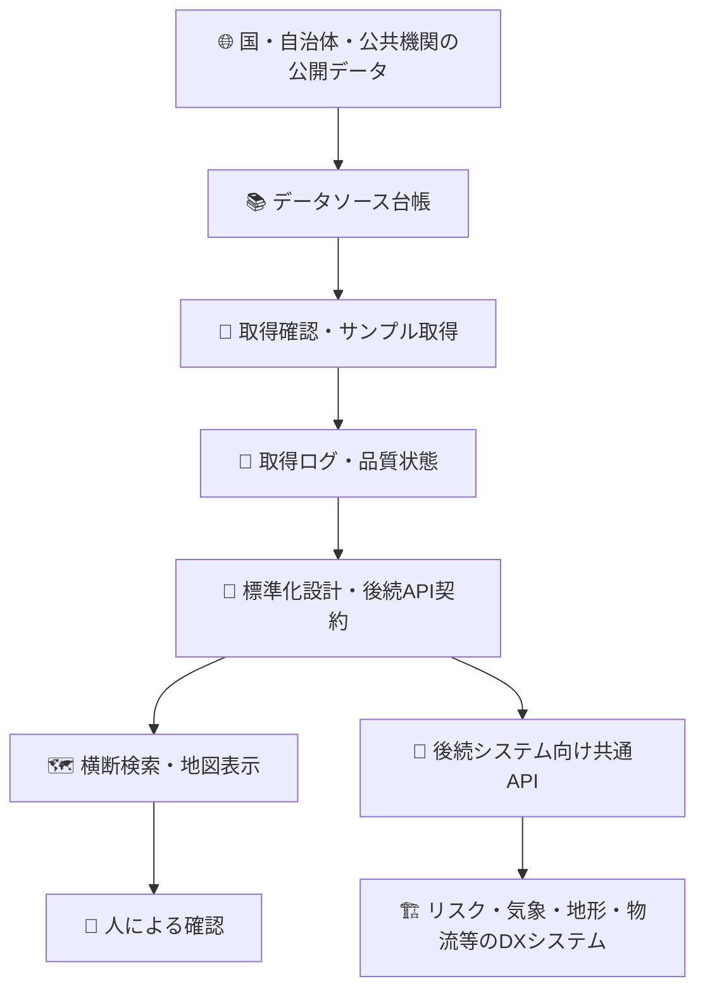
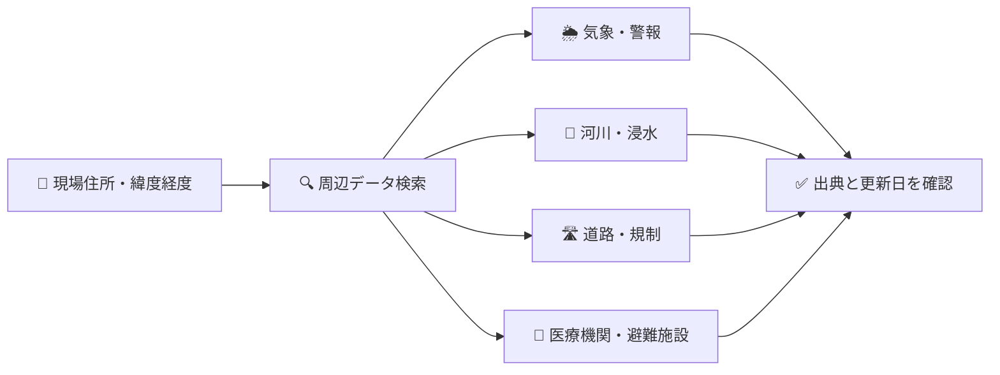
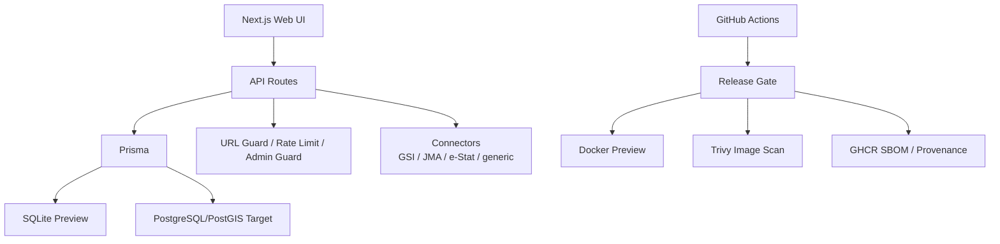
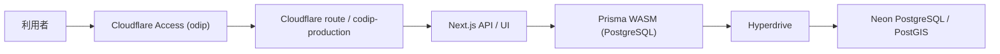

# 🏗️ Civil Open Data Intelligence Platform

## Civil土木建設オープンデータ統合分析基盤 | CODIP


**CODIP** は、国土交通省、国土地理院、気象庁、自治体、道路、河川、防災、都市計画、インフラ、環境などに分散している公開データを、土木建設業務で再利用しやすい形に整理するための共通データ基盤です。

現行MVPは **データソース台帳、取得確認、取得ログ、地図プレビュー、品質状態、後続API、PostgreSQL/PostGIS標準レコード読取経路** を中心に実装しています。共有preview `http://192.168.0.185:3100/` は稼働中です。本番Cloudflare Workers + Hyperdrive + Neonも配備済みですが、2026-08-01時点は稼働Workerが最新のPrisma wasm修正を含まず、DB readiness障害中です。復旧完了までは本番を業務利用可能と判定しません。

> 公開データを探すだけのサイトではなく、土木建設システムが公開データを安全に再利用するための共通データハブです。

---

## 🧭 まず何のシステムか



現在の公開データは、API、CSV、GeoJSON、Shapefile、XML、PDFなど形式がばらばらです。CODIPはまずそれらを台帳化し、取得できるかを確認し、出典・ライセンス・更新日・品質状態を見える化します。

---

## 👥 読む人別の見方

### 1. 👤 非エンジニア向け

CODIPは「土木建設に使える公開データの案内所」です。

| よくある困りごと | CODIPでできること |
| --- | --- |
| どの公開データを見ればよいか分からない | データ名、分野、提供元、利用目的で探せます |
| 情報が古いか不安 | 最終確認日、データ基準日、取得日時を確認できます |
| 出典や利用条件が分からない | ライセンス、出典表記、商用利用可否を確認できます |
| 複数サイトを見るのが大変 | 横断検索と地図表示でまとめて確認できます |

⚠️ CODIPは確認支援システムです。施工可否、安全性、法令適合を自動で断定しません。最終判断は担当者が行います。

### 2. 👷 土木建設現場管理者向け

現場周辺の気象、警報、河川、道路、周辺施設などを素早く確認する入口になります。



### 3. 🧑‍🔧 土木建設技術者向け

候補地、道路、河川、用途地域、標高、災害リスクなどを初期調査するための基盤です。

| 確認軸 | 現行MVP | 次フェーズ |
| --- | --- | --- |
| 台帳 | ✅ 実装済み | 拡充 |
| 取得確認 | ✅ 実装済み | 定期取得 |
| 地図 | ✅ 2Dプレビュー | 実データレイヤー拡充 |
| 標準レコード | ✅ PostGIS読取MVP | 実データ投入・履歴管理 |
| 空間判定 | ✅ PostGIS環境で地点照会MVP | 範囲検索・重複判定拡充 |

### 4. 🔬 土木建設研究者向け

データソースの所在、形式、更新頻度、ライセンス、品質状態を比較できます。APIキー付きデータはHTTPSかつ正規ホストのみへ秘密値を付与する設計です。

### 5. 🏢 会社経営層向け

公開データ調査の重複を減らし、後続システムが同じ形式でデータを使える状態を目指します。仕様変更やURL変更の影響を基盤側へ集約できます。

### 6. 🧑‍💻 社内IT部門スタッフ向け

管理API、取得ログ、品質再計算、後続API、Docker preview、PostgreSQL/PostGIS移行、Cloudflare/Neon staging runbookを整備しています。

---

## 🧱 システム構成



| 領域 | 現在 | 本番目標 |
| --- | --- | --- |
| UI | Next.js | Cloudflare Workers目標 (`@opennextjs/cloudflare`) |
| API | Next.js Route Handlers | Cloudflare Workers分離候補 |
| DB | SQLite preview / PostgreSQL schema | Neon PostgreSQL + PostGIS |
| 認証 | 管理トークン / HttpOnly Cookie | Cloudflare Access + proxy secret |
| CI | GitHub Actions | SHA固定Actions、CodeQL、Trivy、SBOM/provenance |
| 本番URL | 共有preview `http://192.168.0.185:3100/` | `https://odip.mirai-dx-platform.com` |

---

## 🚨 本番稼働状況 (2026-08-04)



| 確認項目 | 実測 | 判定 |
| --- | --- | --- |
| 正式URL | `https://odip.mirai-dx-platform.com` | ✅ DNS/TLS/route到達 |
| Access | Cloudflare Access app `odip`（mirai-const.co.jp + kensan1969@gmail.com） | ✅ 未認証は302→login |
| Health / Ready | 未認証は302。Access認証済みブラウザで正常閲覧を確認 (2026-08-02) | ✅ Worker/DB稼働 |
| 稼働deployment | `codip-production` 2026-08-01T15:33Z（main `5f76656` 相当） | ✅ Workers wasm修正反映済 |
| Neon | PostgreSQL 17.10 / PostGIS 3.5、migration 2/2、整合性異常0 | ✅ DB rollback不要 |
| Backup | scheduled 12/12失敗、暗号化artifact 0 | ❌ Issue #63 |
| 定期smoke | scheduled production smokeは未認証302のため失敗継続。Access service token設定が必要 | ⚠️ Issue #90 |

定期検知は `.github/workflows/production-smoke.yml` が15分ごとにstrict read-only probeを実行します。odipはCloudflare Access配下のため、監視にはAccess service token（`CF_ACCESS_CLIENT_ID` / `CF_ACCESS_CLIENT_SECRET`）をGitHub Actions Secretへ設定する必要があります。通知先設定と初回通知テストは人間の運用設定が必要です。

---

## ✅ 実装済みの主な機能

| 区分 | 内容 |
| --- | --- |
| 📚 台帳 | データソース、提供元、カテゴリ、形式、ライセンス、タグ |
| 🔍 検索 | キーワード、カテゴリ、提供元、形式、APIキー要否、状態、タグ |
| 🗺️ 地図 | 地理院タイル、GeoJSON貼り付け、標高取得 |
| 🧾 運用ログ | 接続確認ログ、サンプルレスポンス、保持期間dry-run |
| 🛡️ セキュリティ | 管理API保護、CSRF、Rate Limit、SSRF対策、秘密URL拒否 |
| 🔗 後続API | `/api/v1/records/search`, `/point`, `/layers`, `/freshness` |
| 🐳 Docker | production runner / preview runner / PostgreSQL preview |
| 🚦 CI | lint、型、単体、build、release smoke、PostGIS、Docker、CodeQL |

---

## 🚦 過去のリリースゲート証跡

以下は2026-07-19T15:41Z (2026-07-20 JST) 時点の履歴です。現在状態は上記「本番稼働状況」とGitHub `main@83b1b91` のCI証跡を正とします。

| 区分 | 状態 | 証跡 |
| --- | --- | --- |
| branch | 🟢 main | release hardening + dependency maintenance |
| commit | 🟢 `1d66e48` | `build(deps): bump app dependencies` |
| CI run | 🟢 success | `29693346265` |
| CodeQL run | 🟢 success | `29693346235` |
| verify | 🟢 pass | lint、型、単体、契約、build、smoke |
| e2e | 🟢 pass | Playwright CI browser |
| postgresql-compat | 🟢 pass | PostGIS migration、seed、`/api/v1` standard_records smoke |
| node-preview | 🟡 追加済み | Docker非依存の `next start` + `release:smoke`。#35 のbranch protection差し替え候補 |
| docker-preview | 🟢 pass | preview-runner migration/seed、production runner smoke |
| docker-image-security | 🟢 pass | Trivy High/Critical CVE check |
| production-target-env | ⚪ skipped | `workflow_dispatch` で実staging/production Secretsを読む手動ゲート |
| docker-supply-chain | 🟢 pass | GHCR image push、SBOM attestation、`mode=max` provenance |
| CodeRabbit | 🟢 pass | PR #52 / #56 success。オープンPRなし |

⚠️ `production-target-env` はmain greenだけでは完了しません。Cloudflare/Neon実ターゲット検証は、staging/production移行時に承認済みSecrets/Variablesを読み込んで別途記録します。

---

## ✅ リリース後preview確認 (2026-07-19)

| 区分 | 確認結果 |
| --- | --- |
| URL | `http://192.168.0.185:3100/` |
| 主要画面 | ダッシュボード表示成功。登録データソース56件、カテゴリ別集計、最近登録データ表示を確認 |
| ブラウザログ | Chrome console error/warn 0件 |
| API | `/api/health` 200、`/api/ready` 200、`/api/dashboard` 200、`/api/sources` 200、`/api/openapi` 200 |
| 管理保護 | `/api/fetch-logs` は未認証401、`/api/admin/audit-events` のGETは405 |
| DB | `/api/ready` 200でアプリからDB接続を確認。共有previewは正本Neonではなくローカル/preview DB |
| Cloudflare/Neon | production targetは `odip.mirai-dx-platform.com`。2026-08-01再確認ではhealth 200、ready 503。Neon自体は正常で、稼働Workerがwasm修正前であることをログとdeployment時刻から確定 |

### 🔧 2026-07-19 安定化改善

| 区分 | 内容 |
| --- | --- |
| Workers互換 | SSRF事前DNS検証を `dns.lookup` から `resolve4` / `resolve6` へ変更。Workers上のfail-closed範囲を縮小 |
| 標準レコード | `standardRecordsAvailable()` を60秒TTL + single-flight化し、標準データのロールバック/空化と並行アクセス競合へ対応 |
| 管理認証 | `CODIP_DISABLE_TOKEN_AUTH=true` を追加。Cloudflare Access等のproxy authを正とする環境で、直接token経路と、tokenから導出される署名済みセッションCookieの両方を無効化できる |
| 依存関係 | PR #52で `undici` 8.7.0、`@eslint/eslintrc` 3.3.6、`autoprefixer` 10.5.4、`eslint` 9.39.5、`tailwindcss` 3.4.19、`vitest` 3.2.7、`wrangler` 4.112.0などへ更新。main CI/CodeQL成功 |
| テスト | URL guard、標準レコード可用性、管理認証、環境変数検証、管理セッションAPIの回帰テストを追加 |

## ✅ リリース準備履歴 (2026-07-18 再検証)

`branch agent/release-readiness-postgis-ci` (当時のPR #17 Draft, commit `1f1d570`) を 2026-07-18 に再検証した履歴です。現在のリリース判断は上記のmain最新証跡を正とします。

| 区分 | コマンド | 結果 |
| --- | --- | --- |
| 静的解析 | `npm run lint` | 🟢 0 errors |
| 型検査 | `npm run typecheck` | 🟢 0 errors |
| 単体テスト | `npm run test` | 🟢 222 passed / 21 files |
| 契約チェック | `release:check-{v1-contract,doc-api-contract,openapi-coverage,docker-contract,cloudflare-contract,github-actions-contract}` | 🟢 all OK (19 API routes covered) |
| 本番ビルド | `npm run build` | 🟢 success (27 routes) |
| リリースゲート | `npm run release:gate` | 🟢 OK |
| SQLite duplicate公式URL | `db:check-duplicates` | 🟢 no duplicates |
| 標準レコード方針 | `db:check-standard-record-policy` (PostgreSQL) | 🟢 standard_records=1 |
| Prisma model parity | `db:compare-schemas` | 🟢 OK |
| PostgreSQL schema検証 | `db:pg:validate` | 🟢 schema valid |
| PostgreSQL drift | `db:pg:check-drift` (PostGIS docker上) | 🟢 OK (GiST index ignoredは仕様) |
| PostGIS DDL | `db:pg:check-postgis-ddl` | 🟢 OK |
| env検証 (local) | `validate-env --mode local` | 🟢 OK (警告のみ) |
| env検証 (preview) | `validate-env --mode preview` | 🟢 OK |
| Docker PostGIS preview | `docker compose -f docker-compose.postgresql-preview.yml up --build` | 🟢 healthy (port 3102) |
| `release:smoke` (PostGIS環境) | `npm run release:smoke -- --base-url http://127.0.0.1:3102 --expect-standard-records --expect-seed-standard-record` | 🟢 80 checks passed |
| 秘密情報混入確認 | `grep -E "password|api[_-]?key|secret|token" --include="*.ts"` | 🟢 ソース内の機密値ゼロ (URL safety regex, label, placeholder のみ) |
| TODO/FIXME | `grep -E "TODO|FIXME|XXX|HACK"` src/ scripts/ docs/ | 🟢 検出0件 |
| E2E (ローカル) | `npm run test:e2e` | ⚪ Chromium `SIGTRAP` で18件失敗。CI `e2e` ジョブは `pass` 実績。本制約は §既知制約 に既載 |

### 🏗️ 本番インフラの状態

2026-07-20 更新: Cloudflare本番サブドメインは `odip.mirai-dx-platform.com` で確定済みです。routingは zone route方式 (`routes[].pattern=<FQDN>/*` + `zone_name` + proxied AAAA `100::`) を採用し、決定記録は `docs/runbooks/cloudflare-production.md` §1.1 を正とします。

| リソース | 状態 |
| --- | --- |
| Cloudflare Hyperdrive | 🟢 作成済み `codip-production` (caching disabled、`scripts/deploy/create-hyperdrive.mjs` で払い出し、`wrangler.jsonc` に実ID反映済み) |
| Neon production | 🟢 既存 project `falling-dawn-93620497` の default branch を本番として使用 (PostGIS、migration適用済み、pre-release backup branch取得済み) |
| Worker `codip` | 🔴 稼働中だが古いdeployment。`/api/health` 200、`/api/ready` 503。native Prisma engine初期化失敗をWorkers Logsで確認し、最新main再デプロイ待ち |
| DNS record | 🟡 Cloudflare A/AAAAへ解決済み。zone route方式の proxied `AAAA 100::` が意図通りかはCloudflare Dashboard / Wranglerで証跡化する |
| Worker Secrets | ⚠️ 要確認。値は出力せず、Secrets登録有無だけを承認済みCloudflare認証で確認する |
| Cloudflare Access | ⚠️ 要確認。未設定またはproxy secret未整備の場合、管理系はfail-closed全拒否として扱う |

現時点の最優先ステップは、`83b1b91` と本安定化修正を含むimmutable SHAを通常CIで検証し、承認済みCI/CD経路から再デプロイすることである。DNS、Secrets、DBは変更せず、デプロイ後にstrict read-only smokeを実行して `/api/ready=200` と主要DB経路の復旧を確認する。

| # | 作業 | 実行者 |
| --- | --- | --- |
| 1 | PRの通常CI、CodeQL、Cloudflare bundle artifact検査を成功させ、復旧候補SHAを固定 | CTO/運用 |
| 2 | 固定SHAを承認済みCI/CD経路から再デプロイし、Worker deployment IDと時刻を保存 | 人間承認 + ReleaseManager |
| 3 | `/api/ready`、主要画面/API、`release:smoke --read-only`、Workers error logを再確認。失敗時のみ既知正常版へのWorker rollbackを検討 | CTO/運用 |
| 4 | Cloudflare Access application/policy と `CODIP_TRUST_PROXY_SECRET` 登録状態を確認し、管理系fail-closedを維持 | 人間 (ユーザー) / 承認済み作業者 |

### ⚠️ 残課題

- **Cloudflare Workers ランタイム互換**: [Issue #18](https://github.com/Kensan196948G/Civil-Open-Data-Intelligence-Platform/issues/18)。SSRF事前DNS検証は `dns.promises.resolve4` / `resolve6` へ変更済み。接続時DNSピン留めはNode.js/Undiciで継続し、Cloudflare Workersでは同等保証ができないため外部URL取得を `unsupported_runtime` で安全停止する。PostgreSQL Prisma Clientは `@prisma/adapter-pg` によりHyperdrive `connectionString` を消費できる構成へ変更済み。残りは実Cloudflare/Neon証跡
- **main branch protection**: 現在は有効。required checksは `verify` / `e2e` / `postgresql-compat` / `docker-preview` / `docker-image-security` / `analyze`、strict=true、admin enforcement=true。今後はrequired review数やCode Ownersの要否を運用成熟度に合わせて判断する
- **本番監視のAccess対応**: `odip` はCloudflare Access配下のため、未認証のscheduled smokeは302を受け失敗します。監視用service tokenの作成と `CF_ACCESS_CLIENT_ID` / `CF_ACCESS_CLIENT_SECRET` のGitHub Actions Secret登録、通知テストが未完了 (Issue #90)。Access変更は人間承認境界
- **Cloudflare staging Hyperdrive**: 現行 `CLOUDFLARE_API_TOKEN` にHyperdrive作成権限がないため (code 10000)、Cloudflare stagingデプロイはブロック中。Neon staging branch `staging-20260804` は作成済み。権限追加またはDashboard操作が必要
- **Neon pg_dump定期ジョブの初回scheduled証跡**: [Issue #63](https://github.com/Kensan196948G/Civil-Open-Data-Intelligence-Platform/issues/63)。Secrets (`CODIP_NEON_PGDUMP_DATABASE_URL` / `CODIP_NEON_BACKUP_ENCRYPTION_PASSPHRASE`) と Variables（host照合・restore drill 2026-08-04）は設定済み。pg_dump 17 client修正をmainへ反映後、scheduled初回成功とartifact証跡を確認する
- **De-dockerization移行中**: [Issue #35](https://github.com/Kensan196948G/Civil-Open-Data-Intelligence-Platform/issues/35)。Docker jobはbranch protection互換のため残し、先にDocker非依存の `node-preview` CIゲートを追加して差し替え先を育てる

🔒 **本番アプリはCloudflare Access配下で稼働中**。残る本番ブロッカーは監視用Access service token（Issue #90）とNeon pg_dump Secrets設定（Issue #63）です。手順は [`docs/runbooks/cloudflare-production.md`](docs/runbooks/cloudflare-production.md) と [`docs/runbooks/monitoring.md`](docs/runbooks/monitoring.md) を参照してください。

---

## 🔐 セキュリティ方針

| 項目 | 方針 |
| --- | --- |
| 管理操作 | `CODIP_ADMIN_TOKEN` またはCloudflare Access相当の前段保護が必須 |
| 管理UI | トークンをlocalStorageへ保存せず、署名済みHttpOnly Cookieを使用 |
| CSRF | 管理セッションCookie/Proxy認証の変更系操作は同一Origin必須 |
| SSRF | private / loopback / metadata IP、非HTTP、認証情報付きURLを拒否 |
| APIキー | DB・ログに保存しない。e-Stat等はHTTPS正規ホストのみへ実行時付与 |
| Proxy認証 | `CODIP_DISABLE_TOKEN_AUTH=true` で直接token経路を無効化し、Cloudflare Access + proxy secret + allowlist を正本にできる |
| Rate Limit | 公開API、管理API、取得系API、タグAPIに適用 |
| Supply Chain | Docker base image digest固定、GitHub Actions SHA固定、Trivy scan |
| Preview DB image | PostGIS service imageもdigest固定 |

---

## 🚀 ローカル起動

```bash
npm ci
DATABASE_URL='file:./dev.db' npm run db:migrate
DATABASE_URL='file:./dev.db' npx prisma db seed
DATABASE_URL='file:./dev.db' npm run dev
```

WebUI:

```text
http://localhost:3000
```

Docker preview (compose が公開するポート):

```text
http://127.0.0.1:3100   # docker-compose.preview.yml (SQLite)
http://127.0.0.1:3102   # docker-compose.postgresql-preview.yml (PostgreSQL/PostGIS)
```

管理操作をローカルで試す場合:

```bash
export CODIP_ADMIN_TOKEN="change-this-very-long-random-token-32"
DATABASE_URL='file:./dev.db' npm run dev
```

`/settings` で管理操作トークンを入力し、管理セッションを開始します。

---

## 🧪 主要コマンド

WindowsのUNCパス (`\\server\share\...`) 直下で `npm run ...` を実行すると、npmが内部で起動する `cmd.exe` がカレントディレクトリを `C:\Windows` へ落とし、相対パスのスクリプトが見つからないことがあります。共有フォルダ上でリリースゲートやCloudflare検証を実行する場合は、先に一時ドライブへ割り当ててから実行します。

```powershell
cmd /c "pushd \\192.168.0.185\kensan\Projects\Mirai-DX-Project\Civil-Open-Data-Intelligence-Platform && npm run release:production-evidence -- --strict"
```

| コマンド | 用途 |
| --- | --- |
| `npm run dev` | 開発サーバー起動 |
| `npm run start:checked` | 環境変数検査後に本番サーバー起動 |
| `npm run build` | 本番ビルド |
| `npm run lint` | 静的チェック |
| `npm run typecheck` | Prisma Client生成を含む型検査 |
| `npm run test` | 単体テスト |
| `npm run test:e2e` | Playwright E2E。保護preview相当で管理セッションも確認 |
| `npm run release:gate` | audit、契約、schema、env、lint、型、単体、build |
| `CODIP_ADMIN_TOKEN=... npm run release:smoke -- --base-url http://127.0.0.1:3100` | 起動中アプリのHTTPスモーク |
| `npm run release:smoke -- --read-only --base-url https://...` | staging/production向けの非破壊HTTPスモーク |
| `npm run release:smoke -- --base-url http://127.0.0.1:3102 --expect-standard-records` | PostGIS投入環境で `/api/v1` の `standard_records` modeを強制確認 |
| `npm run release:smoke -- --base-url http://127.0.0.1:3102 --expect-standard-records --expect-seed-standard-record` | PostgreSQL seed入りCI/previewで検証用標準レコードとproperties sanitizationも確認 |
| `npm run release:post-release-status -- --production-url https://odip.mirai-dx-platform.com --max-response-ms 5000` | Cloudflare/Neonを変更せず、production DNS/health、応答時間、`/api/ready` DB状態、共有preview、522時のWorker route診断をMarkdownで確認。DNS未接続は通常モードでは記録のみ |
| `npm run release:cloudflare-522-diagnostics` | Cloudflareへ接続せず、production `wrangler.jsonc` route/Hyperdrive/observability契約と522時に採るべきread-only証跡をMarkdown化。承認済みCloudflare認証がある場合のみ `-- --execute-wrangler` で `deployments status/list` を実行 |
| `npm run db:migrate` | SQLite preview/localへ既存migrationを適用 |
| `npm run db:migrate:dev` | schema作成者向け。新規migration生成時のみ使用 |
| `npm run release:check-docker-contract` | Dockerfile、`.dockerignore`、image scan、SBOM/provenance契約 |
| `npm run release:check-cloudflare-contract` | Cloudflare/Neon staging runbook契約 |
| `npm run release:check-github-actions-contract` | actionlint、危険trigger、Action SHA固定契約 |
| `npm run release:validate-env:production-target` | 実Cloudflare/Neon targetのSecrets/Variables検証。productionでは `https://odip.mirai-dx-platform.com` 固定 |
| `npm run release:production-evidence -- --strict` | 実Cloudflare/Neon target、Wrangler本番構成、監視・アラート、バックアップ・リストアの証跡MarkdownをSecret値なしで出力し、未充足Evidenceを検知 |
| `npm run release:create-neon-backup-evidence` | `pg_dump` artifactのファイルmetadataまたはartifact IDから、Secretを含まないNeon backup証跡JSONを生成 |
| `npm run release:check-neon-backup-evidence` | `CODIP_NEON_BACKUP_EVIDENCE_JSON` からPITR window、pg_dump 24h鮮度、restore drill 30日鮮度を非Secretで検査 |
| `.github/workflows/neon-backup.yml` | 毎日03:17 JSTにNeon `pg_dump` を暗号化artifact化し、非Secret証跡JSONを生成。Secret未設定・restore drill未記録ならfail-closed |
| `npm run release:post-release-status -- --strict-production --max-response-ms 5000` | 本番DNS/health/DB ready/応答時間が未達なら失敗させる本番化後の監視ゲート |
| `npm run release:check-production-placeholders -- --env production` | 実デプロイ前にproduction Hyperdrive ID等の未解決placeholderを拒否 |
| `npm run release:check-cloudflare-build-artifact` | `npm run cf:build` 後に `.open-next/worker.js` と `.open-next/assets` が揃っていることを確認 |
| `npm run cf:deploy:production` | 実target env検証、production evidence strict、placeholder検査、Cloudflare build、artifact検査、OpenNext deploy `--env production` を固定順序で実行。人間承認済みCI/CD経路または明示操作のみ |
| `npm run db:pg:check-postgis-ddl` | PostGIS DDL確認 |
| `npm run db:pg:check-drift` | PostgreSQL schema drift確認 |
| `npm run db:prune -- --dry-run` | 運用ログ保持期間の削除候補確認 |

---

## 🐳 Docker Preview

SQLite preview:

```bash
export CODIP_ADMIN_TOKEN="change-this-very-long-random-token-32"
export CODIP_SEED_ON_START=true
docker compose -f docker-compose.preview.yml up --build
```

Preview URL: `http://localhost:3100`

PostgreSQL/PostGIS preview:

```bash
export CODIP_ADMIN_TOKEN="change-this-very-long-random-token-32"
export CODIP_SEED_ON_START=true
docker compose -f docker-compose.postgresql-preview.yml up --build
```

Preview URL: `http://localhost:3102`

production `runner` は `npm ci --omit=dev` を使い、起動時migrationを行いません。migration/seedはone-off release jobで実行します。

---

## 🔗 後続システム向けAPI

| API | 用途 | 現行MVPの注意 |
| --- | --- | --- |
| `/api/v1/records/search` | 標準レコード検索 | PostGIS環境は `standard_records`、SQLite/未投入時は `catalog_metadata_only` warning |
| `/api/v1/records/point` | 地点照会 | PostGIS環境は空間評価、SQLite/未投入時は `not_standardized` warning |
| `/api/v1/layers` | レイヤー一覧 | PostGIS環境は標準レコード由来、SQLite/未投入時は `catalog_only` |
| `/api/v1/layers/{id}/features` | GeoJSON FeatureCollection | PostGIS環境はFeature返却、SQLite/未投入時は未標準化を明示 |
| `/api/v1/sources/{id}/freshness` | 鮮度・品質状態 | 出典と品質確認用 |

---

## 📁 ドキュメント

| ファイル | 内容 |
| --- | --- |
| [docs/01-requirements-definition.md](docs/01-requirements-definition.md) | 要件定義 |
| [docs/02-detailed-design-specification.md](docs/02-detailed-design-specification.md) | 詳細仕様設計 |
| [docs/03-system-architecture.md](docs/03-system-architecture.md) | アーキテクチャ |
| [docs/04-api-design.md](docs/04-api-design.md) | API設計 |
| [docs/05-data-model-and-database.md](docs/05-data-model-and-database.md) | データモデル・DB |
| [docs/09-security-and-compliance.md](docs/09-security-and-compliance.md) | セキュリティ・コンプライアンス |
| [docs/12-test-plan.md](docs/12-test-plan.md) | テスト計画 |
| [docs/13-deployment-and-operations.md](docs/13-deployment-and-operations.md) | デプロイ・運用 |
| [docs/16-release-readiness-checklist.md](docs/16-release-readiness-checklist.md) | リリース直前チェック |
| [docs/release-notes.md](docs/release-notes.md) | リリース後確認・安定化履歴 |
| [docs/runbooks/cloudflare-production.md](docs/runbooks/cloudflare-production.md) | `odip.mirai-dx-platform.com` 本番化Runbook |
| [docs/runbooks/cloudflare-neon-staging.md](docs/runbooks/cloudflare-neon-staging.md) | Cloudflare/Neon staging・rollback補助Runbook |
| [docs/runbooks/monitoring.md](docs/runbooks/monitoring.md) | 監視・アラート・初動確認手順 |
| [docs/runbooks/database-deployment.md](docs/runbooks/database-deployment.md) | DBデプロイ、バックアップ、SQLite復元、PostgreSQL/PostGIS移行前チェック |
| [docs/runbooks/rollback.md](docs/runbooks/rollback.md) | 障害時の切り戻し手順 (判断フロー、Workers、GHCR、Neon PITR、Prisma、SQLite) |

---

## 🎯 MVP成功条件

| 指標 | 目標 |
| --- | --- |
| 公式データソース | 20件以上 |
| 出典表示率 | 100% |
| ライセンス登録率 | 100% |
| 取得ログ記録率 | 100% |
| 後続API | 3種類以上 |
| 重大な秘密情報ログ出力 | 0件 |
| release gate | 成功 |
| release smoke | 成功 |

---

## ⚠️ 現時点の既知制約

| 制約 | 対応方針 |
| --- | --- |
| ローカルSQLite previewは `standard_records` 未投入 | PostGIS seed/CIでは検証用標準レコードを投入し、`--expect-standard-records` smokeで `/api/v1` の実地物返却を確認 |
| Cloudflare Workersは目標構成 | staging runbook準備済み。実環境証跡は初回deploy時に記録 |
| 3D都市モデル表示は未実装 | PLATEAU連携フェーズで扱う |
| AI判断機能は未実装 | 検索支援・要約補助に限定して将来導入 |
| E2Eはブラウザ環境依存 | CIまたはブラウザ実行可能環境で再検証 |

---

## 🧑‍⚖️ 判断方針

AIやシステムは確認支援までです。施工可否、安全性、災害発生、法令適合を断定しません。出典、基準日、取得日時、ライセンス、品質状態を確認したうえで、最終判断は人が行います。
