# 🏗️ Civil Open Data Intelligence Platform

## 土木建設オープンデータ統合分析基盤


---

## 📌 このシステムについて

**Civil Open Data Intelligence Platform** は、
国土交通省・自治体・気象庁・国土地理院・道路・災害・統計などの
**公開データや公開APIを横断的に探し、確認し、記録するための土木建設向けデータ基盤**です。

簡単に言うと、

> 「どこに、どんな土木建設向け公開データがあるのか？」
> 「そのデータは使えるのか？」
> 「APIとして取得できるのか？」
> 「最後に確認したのはいつか？」

を整理するためのシステムです。

---

## 🎯 目的

このシステムの目的は、
土木建設DXで利用できる公開データを、
**人が探し回らなくても、一覧・検索・接続確認できる状態にすること**です。

---

## 🧭 システムの位置づけ

このシステムは、単体の便利ツールではなく、
今後作成する複数の土木建設DXシステムの**土台**になります。

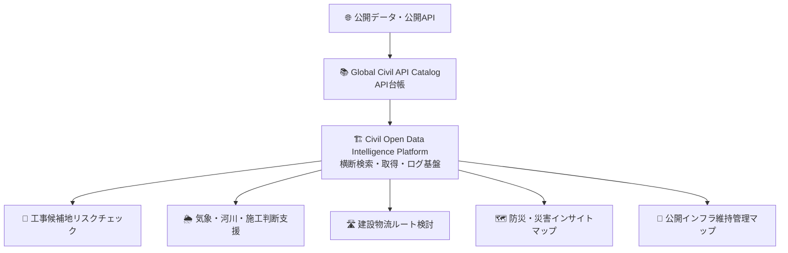

---

## 🏷️ 関連リポジトリ

| 種類      | リポジトリ                                   |
| ------- | --------------------------------------- |
| API台帳   | `Global-Civil-API-Catalog`              |
| 本システム候補 | `Civil-Open-Data-Intelligence-Platform` |

関連URL：

```text
https://github.com/Kensan196948G/Global-Civil-API-Catalog.git
```

---

## 👥 想定利用者

| 利用者            | 主な使い方                   |
| -------------- | ----------------------- |
| 👷 土木技術者       | 工事候補地、道路、地形、防災、気象データを探す |
| 🧑‍💼 現場管理者    | 現場周辺の公開情報を確認する          |
| 🧑‍💻 IT・DX担当者 | APIや公開データの接続可否を確認する     |
| 🏢 経営・企画担当     | 公開データを活用したDX施策を検討する     |
| 🤖 他のDXシステム    | 共通データ基盤として利用する          |

---

## 💡 できること

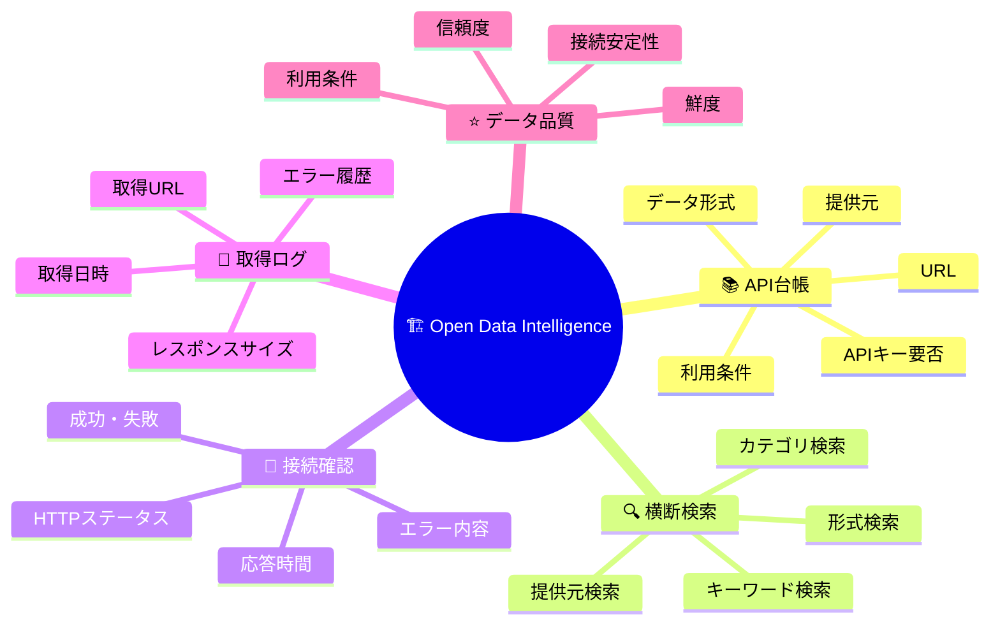

---

## 🧩 主な機能

| 機能             | 内容                           |
| -------------- | ---------------------------- |
| 📚 API・公開データ台帳 | 公開APIや公開データを一覧管理します          |
| 🔍 検索画面        | キーワード、分類、提供元、形式などで検索できます     |
| 🔌 接続確認        | APIやURLが現在取得できるか確認します        |
| 🧾 取得ログ        | いつ、どのURLに、どのような結果で接続したか記録します |
| 🏷️ タグ管理       | 災害、道路、気象、地形などのタグを付けます        |
| ⭐ 品質評価         | 信頼度、鮮度、利用条件の明確さを確認します        |
| 📊 ダッシュボード     | 登録件数、成功件数、失敗件数を見える化します       |
| 🤖 AI支援        | データ概要の要約や活用候補の提案を補助します       |

---

## 🌐 初期対象データ

最初は、以下のような公開データ・公開APIを登録対象とします。

| 分類        | データ例          | 用途              |
| --------- | ------------- | --------------- |
| 🗾 国土・GIS | 国土数値情報        | 土地利用、災害、交通、都市計画 |
| 🏙️ 3D都市  | PLATEAU       | 3D都市モデル、建物、都市構造 |
| 🛣️ 道路    | xROAD         | 道路、交通量、道路施設     |
| 🗺️ 地図・標高 | 国土地理院         | 地図、標高、地形確認      |
| 🌦️ 気象    | 気象庁データ        | 雨量、風、警報、防災情報    |
| 📊 統計     | e-Stat        | 人口、地域統計、産業統計    |
| 🧭 地図情報   | OpenStreetMap | 道路、施設、周辺環境      |
| 🏛️ 自治体   | 自治体オープンデータ    | 避難所、公共施設、地域情報   |

---

## 🧱 全体構成

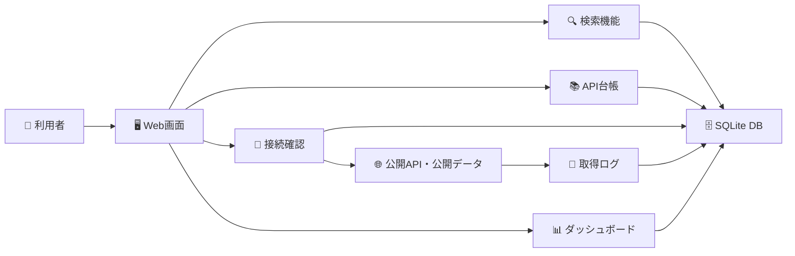

---

## 🖥️ 画面イメージ

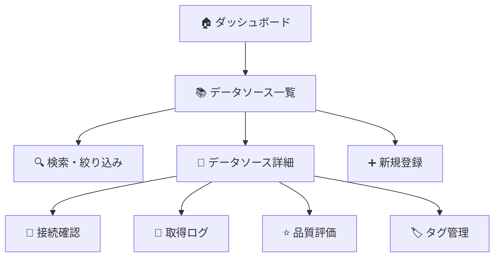

---

## 📊 ダッシュボードで見えるもの

| 表示項目        | 内容                 |
| ----------- | ------------------ |
| 📚 登録データ数   | 登録済みのAPI・公開データ数    |
| ✅ 接続成功数     | 取得確認に成功した件数        |
| ❌ 接続失敗数     | 取得確認に失敗した件数        |
| ⚠️ 要確認数     | 利用条件や接続状況の確認が必要な件数 |
| 🏷️ カテゴリ別件数 | 災害、道路、気象などの分類別件数   |
| 🧾 最近の取得ログ  | 直近の接続確認結果          |

---

## 🔍 検索できる項目

| 検索条件    | 例                        |
| ------- | ------------------------ |
| キーワード   | 河川、道路、標高、災害、交通量          |
| 提供元     | 国土交通省、気象庁、国土地理院、自治体      |
| カテゴリ    | GIS、気象、防災、道路、統計          |
| データ形式   | JSON、XML、CSV、GeoJSON、PDF |
| APIキー要否 | 必要／不要                    |
| 接続状態    | 成功／失敗／未確認                |
| 利用条件    | 商用利用可、要確認など              |

---

## ⭐ データ品質の考え方

公開データは便利ですが、
そのまま何でも信用するのは危険です。

そのため、このシステムでは以下の観点で確認します。

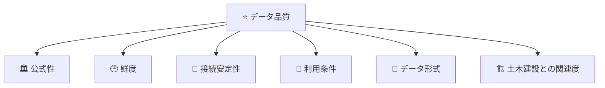

---

## 🧹 データクレンジング方針

登録・取得したデータは、以下の観点で整理します。

| 項目        | 内容                   |
| --------- | -------------------- |
| 🏛️ 提供元確認 | 公式機関・自治体・信頼できる提供元か確認 |
| 🔗 URL確認  | 公式URLか、古いURLではないか確認  |
| 🕒 更新確認   | 最終更新日や更新頻度を確認        |
| 📦 形式確認   | JSON、XML、CSVなどの形式を確認 |
| 🔁 重複確認   | 同じデータを二重登録しない        |
| 📜 利用条件確認 | 商用利用、出典表記、再配布可否を記録   |
| ⚠️ 要確認管理  | 不明点があるデータは「要確認」として扱う |

---

## 🤖 AI機能について

AIは便利ですが、最終判断は人間が行います。

### AIが補助すること

| AI支援       | 内容                 |
| ---------- | ------------------ |
| 📝 要約      | API説明文や仕様情報を短くまとめる |
| 🏷️ タグ候補   | 災害、道路、気象などのタグ候補を出す |
| 💡 活用案     | どの業務に使えそうか提案する     |
| 🔎 類似データ   | 似た公開データを探す         |
| 🧯 エラー原因推測 | 接続失敗時の原因候補を出す      |

### AIに任せないこと

| 任せない判断       | 理由                 |
| ------------ | ------------------ |
| ❌ 商用利用可否の断定  | 利用規約の正式確認が必要       |
| ❌ 施工可否の判断    | 安全・契約・現場条件が関係する    |
| ❌ 災害リスクの最終判断 | 公的情報や専門判断が必要       |
| ❌ 法務判断       | 正式な確認が必要           |
| ❌ 公共工事での正式判断 | 発注者・仕様書・契約条件の確認が必要 |

---

## 🧑‍💻 開発環境

| 項目      | 内容                   |
| ------- | -------------------- |
| OS      | Windows 11           |
| 開発支援    | Claude Code          |
| 言語      | TypeScript           |
| フレームワーク | Next.js              |
| 画面      | React / Tailwind CSS |
| DB      | SQLite               |
| ORM     | Prisma               |
| 将来候補    | PostgreSQL / PostGIS |
| ソース管理   | GitHub               |

---

## 🚀 セットアップ方法

## 1. リポジトリを取得

```bash
git clone https://github.com/Kensan196948G/Global-Civil-API-Catalog.git
cd Global-Civil-API-Catalog
```

または、新規リポジトリで開始する場合：

```bash
git clone https://github.com/Kensan196948G/Civil-Open-Data-Intelligence-Platform.git
cd Civil-Open-Data-Intelligence-Platform
```

---

## 2. 必要パッケージをインストール

```bash
npm install
```

---

## 3. 環境設定ファイルを作成

```bash
copy .env.example .env
```

`.env` にはAPIキーなどの秘密情報を記載します。

⚠️ 注意：

```text
.env は絶対にGitHubへアップロードしないでください。
```

---

## 4. データベースを作成

```bash
npx prisma migrate dev
```

---

## 5. 初期データを登録

```bash
npx prisma db seed
```

---

## 6. 開発サーバを起動

```bash
npm run dev
```

---

## 7. ブラウザで開く

```text
http://localhost:3000
```

---

## ✅ 起動までの流れ

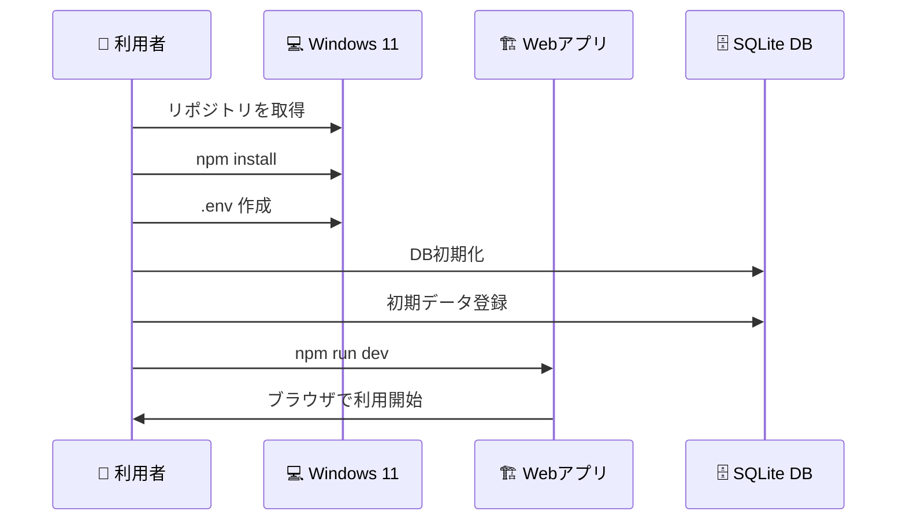

---

## 🧪 テスト方法

単体テスト：

```bash
npm run test
```

Lint：

```bash
npm run lint
```

ビルド確認：

```bash
npm run build
```

---

## 📁 推奨フォルダ構成

```text
Civil-Open-Data-Intelligence-Platform/
├─ README.md
├─ docs/
│  ├─ requirements.md
│  ├─ detailed-design.md
│  ├─ claude-code-instructions.md
│  ├─ data-quality-policy.md
│  ├─ security-checklist.md
│  └─ test-plan.md
├─ prisma/
│  ├─ schema.prisma
│  └─ seed.ts
├─ src/
│  ├─ app/
│  ├─ components/
│  ├─ features/
│  ├─ lib/
│  └─ connectors/
├─ data/
│  ├─ samples/
│  └─ exports/
├─ tests/
├─ .env.example
├─ .gitignore
├─ package.json
└─ tsconfig.json
```

---

## 🗂️ 主要フォルダの説明

| フォルダ              | 内容              |
| ----------------- | --------------- |
| `docs/`           | 設計書、手順書、チェックリスト |
| `prisma/`         | データベース定義と初期データ  |
| `src/app/`        | 画面とAPI          |
| `src/components/` | 画面部品            |
| `src/features/`   | 機能ごとの処理         |
| `src/lib/`        | 共通処理            |
| `src/connectors/` | 公開APIごとの接続処理    |
| `data/samples/`   | サンプル取得データ       |
| `tests/`          | テストコード          |

---

## 🔐 セキュリティ方針

| 項目           | 方針                               |
| ------------ | -------------------------------- |
| 🔑 APIキー     | `.env` に保存し、GitHubに上げない          |
| 🧾 ログ        | APIキーや秘密情報を保存しない                 |
| 🏢 会社資産      | 初期段階では使用しない                      |
| 🌐 外部アクセス    | 登録済みの公開データURLのみ対象                |
| 🚫 任意URL取得   | MVPでは実装しない                       |
| 🛡️ 社内IPアクセス | localhost、社内IP、private IPへの取得は禁止 |
| 📜 利用条件      | 商用利用・出典表記・再配布可否を記録               |

---

## ⚠️ 注意事項

このシステムは、公開データの検索・整理・取得確認を支援するものです。

以下の判断を自動で確定するものではありません。

* 施工してよいか
* 工事して安全か
* 災害リスクがないか
* 商用利用してよいか
* 公共工事で正式に使ってよいか
* 契約上問題がないか

最終判断は、必ず人間が行います。

---

## 🧭 開発ロードマップ

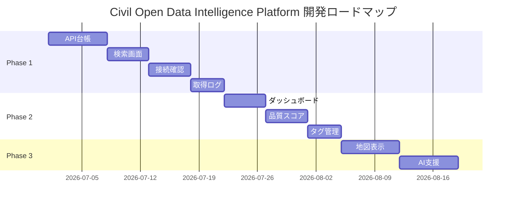

---

## 🧩 今後の拡張予定

| フェーズ    | 内容                               |
| ------- | -------------------------------- |
| Phase 1 | API台帳、検索、接続確認、取得ログ               |
| Phase 2 | ダッシュボード、品質評価、タグ管理                |
| Phase 3 | 地図表示、GeoJSON表示                   |
| Phase 4 | AIによる要約・タグ推薦                     |
| Phase 5 | 工事候補地リスクチェックとの連携                 |
| Phase 6 | 気象・河川・施工判断支援との連携                 |
| Phase 7 | PostgreSQL / PostGIS対応           |
| Phase 8 | 社内CDE・SharePoint・DirectCloud連携検討 |

---

## 🏁 MVP完了条件

最初の完成ラインは以下です。

| 条件        | 内容                    |
| --------- | --------------------- |
| ✅ 起動      | `npm run dev` で起動できる  |
| ✅ 初期データ   | 公開データ10件が登録されている      |
| ✅ 一覧表示    | データソース一覧を表示できる        |
| ✅ 検索      | キーワード・カテゴリで検索できる      |
| ✅ 詳細      | データソース詳細を表示できる        |
| ✅ 登録      | 新しいデータソースを登録できる       |
| ✅ 接続確認    | URLやAPIの疎通確認ができる      |
| ✅ ログ      | 接続確認結果が保存される          |
| ✅ ダッシュボード | 件数・成功・失敗が見える          |
| ✅ ビルド     | `npm run build` が成功する |
| ✅ テスト     | `npm run test` が成功する  |

---

## 🧑‍🏫 非エンジニア向けの見方

このREADMEで見るポイントは、主に以下です。

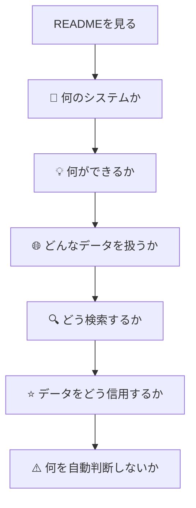

特に大事なのは、以下の3点です。

1. **公開データを探すための基盤であること**
2. **データの取得結果やエラーを記録すること**
3. **AIは補助であり、最終判断は人間が行うこと**

---

## 📜 ライセンス・利用条件について

本システム自体のライセンスとは別に、
登録する公開データごとに利用条件が異なります。

そのため、データソースごとに以下を確認します。

| 確認項目  | 内容           |
| ----- | ------------ |
| 商用利用  | 使えるか、制限があるか  |
| 出典表記  | 表記が必要か       |
| 再配布   | 再配布できるか      |
| APIキー | 必要か          |
| 利用規約  | 公式ページで確認できるか |

---

## 🧯 よくある質問

### Q. このシステムだけで施工判断できますか？

できません。
このシステムは判断材料を集めるための基盤です。
施工可否や安全判断は、必ず人間が行います。

---

### Q. 会社の社内データを使いますか？

初期段階では使いません。
公開データ・公開APIのみを対象にします。

---

### Q. APIキーはGitHubに保存してよいですか？

保存してはいけません。
APIキーは `.env` に保存し、GitHubにはアップロードしません。

---

### Q. AIが全部判断してくれますか？

いいえ。
AIは要約、分類、候補提示の補助です。
利用可否・安全可否・施工可否の最終判断は人間が行います。

---

### Q. 最初に何を作ればよいですか？

最初は以下の順番がおすすめです。

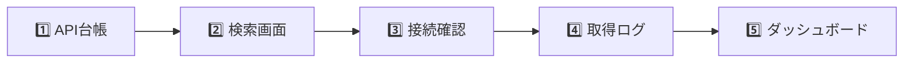

---

## 🧑‍💻 Claude Code 開発方針

Claude Codeには、以下の順番で作業させます。

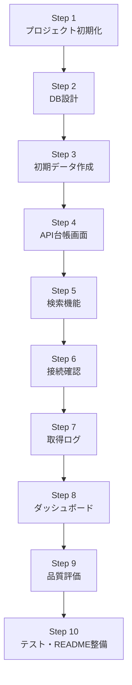

---

## 🚫 Claude Codeへの禁止事項

Claude Codeには、以下を禁止します。

| 禁止事項         | 理由            |
| ------------ | ------------- |
| `.env` のコミット | APIキー漏えい防止    |
| APIキーのログ出力   | 秘密情報保護        |
| 社内データの利用     | 初期段階では公開データのみ |
| 任意URL取得機能    | セキュリティリスク防止   |
| AIによる断定判断    | 人間判断を残すため     |
| 利用条件の自動確定    | 公式確認が必要なため    |

---

## 🏗️ 最終的に目指す姿

このシステムは、将来的に
土木建設DXシステム群の**共通データ基盤**になります。

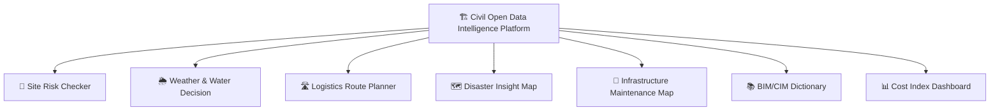

---

## 📣 ひとことで言うと

> 土木建設DXで使える公開データを、
> 探して、確認して、記録して、次のシステムへつなぐための基盤です。

---
