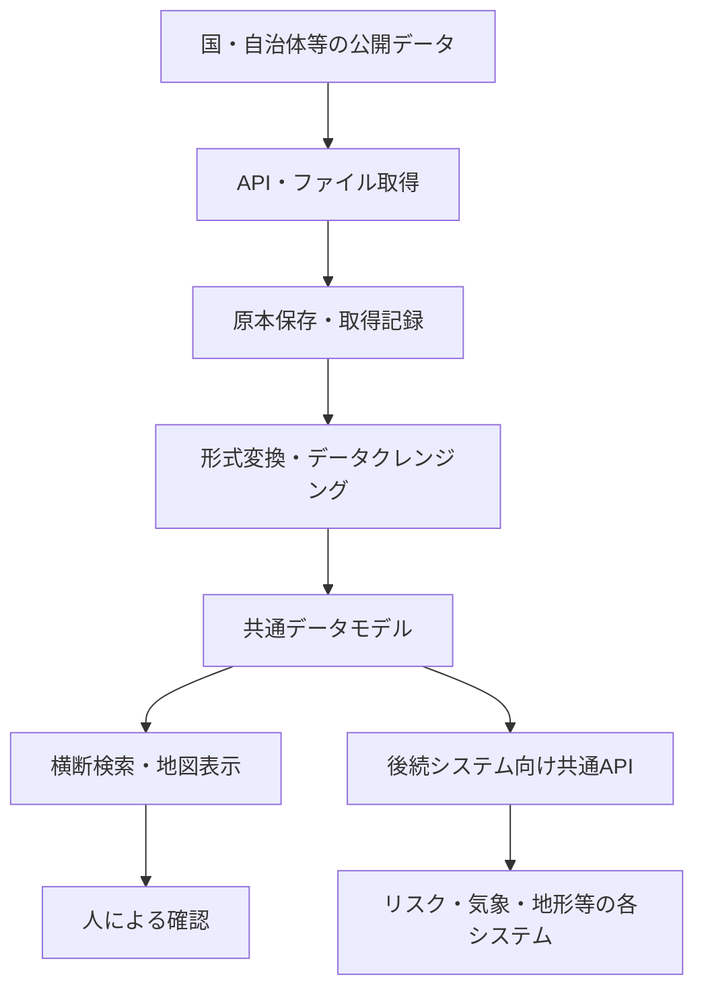

# 要件定義書

## 1. プロジェクト概要

| 項目 | 内容 |
| --- | --- |
| 日本語名 | Civil土木建設オープンデータ統合分析基盤 |
| 英語名 | Civil Open Data Intelligence Platform |
| 略称 | CODIP |
| リポジトリ | `Civil-Open-Data-Intelligence-Platform` |
| 目的 | 分散している土木建設関連の公開データを収集・標準化し、横断検索・地図表示・後続API提供を行う |
| 対象データ | 国交省、国土地理院、気象庁、自治体、道路、河川、防災、都市計画、インフラ、環境 |
| 利用データ | 公開データ、公開API、検証用サンプルデータのみ |
| 判断方針 | AIやシステムは確認支援まで。施工可否、安全性、法令適合を断定しない |

CODIPは、公開データを探すためのサイトではなく、土木建設システムが公開データを安全に再利用するための共通データハブである。

現行MVPでは、データソース台帳、取得確認、取得ログ、品質状態、地図プレビュー、後続API契約の提示を優先する。原本保存基盤、標準レコード本体への本格投入、Cloudflare/Neon本番運用は次フェーズで段階的に実装する。

## 2. 背景と課題

土木建設領域で使える公開データは多いが、提供元、形式、更新頻度、座標系、利用条件が統一されていない。現場、設計、研究、経営、IT部門がそれぞれ個別に調べると、同じ取得処理や確認作業が重複する。

主な課題は次のとおり。

| 課題 | 影響 |
| --- | --- |
| 提供元が分散 | 国、自治体、独立行政法人ごとに調査が必要 |
| 形式が不統一 | API、CSV、GeoJSON、Shapefile、XML、PDFが混在 |
| 座標系が異なる | 地図表示や範囲検索で変換処理が必要 |
| 更新状況が見えにくい | 古いデータを使うリスクがある |
| 利用条件が分かりにくい | 商用利用、再配布、出典表記の判断に時間がかかる |
| API変更に弱い | 後続システムごとに修正が発生する |
| 品質差が大きい | 欠損、地域差、鮮度差を利用者が判断しにくい |

## 3. 解決方針

CODIPは、公開元のデータをそのまま画面に並べるだけではなく、次の流れで共通化する。

## 4. 想定利用者

| 利用者 | 主な用途 |
| --- | --- |
| 非エンジニア | 公開データ活用の全体像、出典、注意点を理解する |
| 土木建設現場管理者 | 気象、警報、河川水位、道路規制、周辺施設を確認する |
| 土木建設技術者 | 工事候補地、地形、河川、道路、都市制約を初期確認する |
| 土木建設研究者 | 公開データの所在、形式、品質、更新頻度を比較する |
| 会社経営層 | 公開データを活用したDX施策、リスク低減、横展開を判断する |
| 社内IT部門スタッフ | API調査、データ取得、後続システム連携、運用監視を行う |
| 開発者 | 共通形式に変換されたデータを利用する |
| 管理者 | API死活、取得失敗、更新遅延、利用条件を管理する |

## 5. スコープ

### MVPに含める

| 区分 | 要件 |
| --- | --- |
| 台帳 | API・データソース台帳、カテゴリ、提供機関、ライセンス、出典管理 |
| 検索 | キーワード検索、カテゴリ・提供元・形式・状態・タグ絞り込み。地域検索はPostGIS後 |
| 地図 | 2D地図プレビュー、手動GeoJSON表示、クリック/入力地点の標高表示 |
| 取得 | 手動取得、接続確認、サンプル取得。定期取得は将来対応 |
| ログ | 取得ログ、エラーログ、処理バージョン、応答時間 |
| 品質 | 欠損、鮮度、公式性、ライセンス明確性、形式利用性の確認 |
| API | 後続システム向け読取API |
| 管理 | 管理画面、Cloudflare Access相当の入口制御 |

### MVPから外す

| 除外項目 | 理由 |
| --- | --- |
| AIによる施工判断 | 判断責任をシステムに持たせない |
| 全国全データの完全収集 | MVPでは代表データで成立性を確認する |
| 本格3D都市モデル表示 | PLATEAU連携は将来フェーズに分離する |
| リアルタイム経路探索 | 道路ネットワーク処理が別システム規模になる |
| 大規模ベクトルタイル生成 | 初期はGeoJSONと2Dプレビューを優先する |
| 社内案件・現場情報の登録 | 公開データ基盤として個別案件情報は扱わない |
| 有償データの購入・再配布 | 利用条件確認が別途必要 |
| 自動的な法令適合判定 | 最終判断は有資格者・担当者が行う |

## 6. 機能要件

| ID | 要件 | 概要 |
| --- | --- | --- |
| FR-001 | データソース台帳登録 | 名称、提供元、URL、形式、地域、更新頻度、利用条件を登録できる |
| FR-002 | 台帳編集 | 登録済みデータソースの情報を編集できる |
| FR-003 | 現行MVP横断検索 | キーワード、カテゴリ、提供元、形式、APIキー要否、状態、タグで台帳検索できる |
| FR-003A | PostGIS後の空間検索 | 地域、住所、地図範囲、地点周辺で検索できる |
| FR-004 | 詳細表示 | 出典、最終確認日時、取得日時、ライセンス、品質状態を確認できる |
| FR-005 | 接続確認 | APIまたは配布URLの疎通確認を実行できる |
| FR-006 | サンプル取得 | 取得可能な範囲でサンプルレスポンスを保存できる |
| FR-007 | 取得ログ | HTTPステータス、件数、サイズ、エラー、処理時間を記録できる |
| FR-008 | 品質評価 | 公式性、鮮度、取得性、ライセンス、形式、建設関連性を評価できる |
| FR-009 | 現行MVP地図表示 | 地理院タイル、手動GeoJSON、クリック/入力地点の標高を2D地図で確認できる |
| FR-009A | PostGIS後の地図レイヤー | 標準化済み点、線、面レイヤーを2D地図で確認できる |
| FR-010 | 後続API | 後続システムが共通形式で検索結果を取得できる |
| FR-011A | 将来AI検索支援 | 自然文検索、要約、類似データ候補提示を将来補助する |
| FR-012 | 管理通知 | 取得失敗、更新遅延、仕様変更疑いを管理者に示せる |

## 7. 非機能要件

| 区分 | 要件 |
| --- | --- |
| セキュリティ | APIキー、接続文字列、認証ヘッダーをDBやログに保存しない |
| 監査性 | 取得日時、取得元、処理結果、エラー内容、処理バージョンを追跡できる |
| 可用性 | MVPでは検証環境優先。本番化時はCloudflare WorkersとNeonの冗長性を活用する |
| 保守性 | データソース別処理はコネクタ方式で拡張する |
| 拡張性 | SQLite MVPからPostgreSQL/PostGISへ移行できる設計にする |
| 利用条件 | ライセンス、出典表記、再配布可否を台帳に保持する |
| 地理精度 | 内部標準座標系は原則 `EPSG:4326` とし、元座標系と変換履歴を保持する |
| アクセシビリティ | 専門外の利用者にも、出典と注意点が分かる表示にする |

## 8. 最初に登録するデータ候補

| 優先 | データ | 目的 |
| ---: | --- | --- |
| 1 | 行政区域 | 地域検索の基準 |
| 2 | 土砂災害警戒区域 | ポリゴン検索の検証 |
| 3 | 洪水・浸水関連情報 | 候補地リスクとの連携 |
| 4 | 標高・地形 | 地点・地形検索 |
| 5 | 気象警報・注意報 | 更新型データの検証 |
| 6 | 医療機関 | 周辺施設検索 |
| 7 | 用途地域 | 都市制約確認 |
| 8 | PLATEAUデータセット台帳 | 将来の3D連携確認 |

## 9. 成功条件

現行MVPの成功状態は次のとおり。

> 利用者がキーワード、カテゴリ、タグ等で複数の公式公開データを台帳横断検索でき、結果ごとに出典、基準日、取得日時、ライセンス、品質状態を確認できる。さらに、後続システムが同じ台帳メタデータを共通API形式で取得できる。

PostGIS標準レコード投入後の成功状態は次のとおり。

> 利用者が住所・緯度経度・地図範囲を指定し、標準化済み地物を含む複数の公式公開データを空間横断検索できる。

定量目標は次のとおり。

| 指標 | 目標 |
| --- | ---: |
| 公式データソース台帳登録 | 20件以上 |
| 実データ接続確認 | 5から8種類 |
| 地図確認機能 | 地理院タイル、GeoJSON貼り付け、標高取得 |
| 取得成功率 | 95%以上 |
| 出典表示率 | 100% |
| ライセンス登録率 | 100% |
| 取得ログ記録率 | 100% |
| API障害検知 | 手動接続確認時に障害状態を記録 |
| 後続システム向けAPI | 3種類以上 |
| 重大な秘密情報のログ出力 | 0件 |
