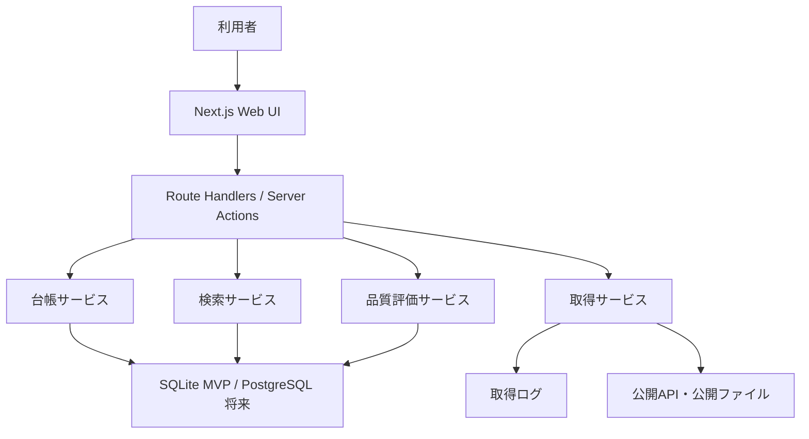
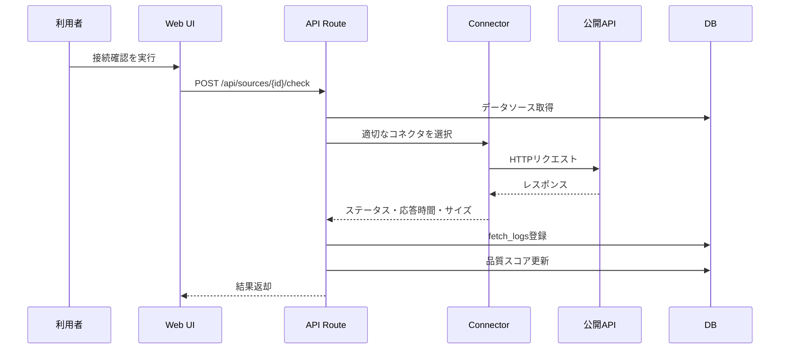

# 詳細仕様設計書

## 1. システム構成

CODIPは、現行MVPではNext.jsアプリとして実装し、将来はCloudflare Workers、Neon PostgreSQL、PostGIS、オブジェクト保存領域を利用する構成へ拡張する。

## 2. 画面仕様

| 画面 | パス | 主な機能 |
| --- | --- | --- |
| ダッシュボード | `/` | 登録件数、成功・失敗件数、要確認件数、最近のログ |
| データソース一覧 | `/sources` | 検索、絞り込み、一覧表示 |
| データソース登録 | `/sources/new` | 台帳項目の新規登録 |
| データソース詳細 | `/sources/[id]` | 基本情報、品質、ログ、接続確認 |
| データソース編集 | `/sources/[id]/edit` | 登録内容の編集 |
| 地図 | `/map` | 地理院タイル、GeoJSON、標高取得 |
| 取得ログ | `/logs` | 接続確認・サンプル取得の履歴 |
| タグ管理 | `/tags` | カテゴリ補助タグの登録・一覧・削除 |
| 設定 | `/settings` | 運用設定、環境変数案内 |

## 3. API仕様

| API | メソッド | 用途 |
| --- | --- | --- |
| `/api/dashboard` | GET | ダッシュボード集計 |
| `/api/sources` | GET/POST | データソース検索・登録 |
| `/api/sources/[id]` | GET/PUT/DELETE | 詳細取得・更新・削除 |
| `/api/sources/[id]/check` | POST | 接続確認 |
| `/api/sources/[id]/fetch-sample` | POST | サンプル取得 |
| `/api/quality/[id]/recalculate` | POST | 品質スコア再計算 |
| `/api/fetch-logs` | GET | 取得ログ一覧 |
| `/api/tags` | GET/POST | タグ一覧・登録 |
| `/api/tags/[id]` | DELETE | タグ削除 |
| `/api/map/elevation` | GET | 地点標高取得 |

後続システム向けAPIは、現行MVP APIとは別に `/api/v1/*` として設計する。詳細は [04-api-design.md](04-api-design.md) を参照する。

## 4. データベース仕様

現行MVPはPrismaとSQLiteを利用する。主要テーブルは次のとおり。

| テーブル | 役割 |
| --- | --- |
| `providers` | 提供機関 |
| `data_sources` | API・公開データ台帳 |
| `tags` | タグ |
| `data_source_tags` | データソースとタグの関連 |
| `fetch_logs` | 接続確認・取得ログ |
| `sample_responses` | サンプルレスポンス |
| `quality_checks` | 品質評価履歴 |
| `related_use_cases` | 関連ユースケース |

将来は、標準化済みデータを `standard_records`、空間形状をPostGIS `geometry`、独自属性をJSONBとして保持する。

## 5. データソース台帳項目

| 分類 | 項目 |
| --- | --- |
| 基本情報 | 名称、英語名、概要、カテゴリ、提供機関 |
| 接続情報 | 公式URL、エンドポイントURL、仕様書URL、取得方式、HTTPメソッド |
| データ形式 | JSON、GeoJSON、CSV、XML、Shapefile、PDF、タイル |
| 地理情報 | 対象地域、座標系、位置精度、空間データ種別 |
| 時間情報 | 更新頻度、最新確認日時、データ基準日 |
| 利用条件 | ライセンス、出典表記、商用利用、再配布可否 |
| 技術情報 | 認証方式、APIキー環境変数名、制限回数、タイムアウト |
| 品質情報 | 欠損率、鮮度、地域網羅性、信頼度 |
| 運用情報 | 最終成功日時、連続失敗数、仕様変更履歴 |
| 利用先 | 接続している後続システム、依存機能 |

## 6. 取得処理仕様

現行MVPでログに残す項目は、実行日時、対象データソース、HTTPステータス、応答時間、データサイズ、Content-Type、エラー種別、エラー内容、connector名とする。APIキーや認証ヘッダーは保存しない。リクエスト識別子、取得件数、再試行回数、クレンジング結果、データ基準日、取得処理バージョンは定期取得・標準化処理の導入時に拡張する。

## 7. コネクタ仕様

コネクタは `DataConnector` インターフェースに従う。

| メソッド | 内容 |
| --- | --- |
| `canHandle(source)` | 対象データソースを処理可能か判定する |
| `check(source)` | 疎通確認を行う |
| `fetchSample(source)` | サンプル取得を行う |

現行候補は、汎用HTTP、国土地理院標高、気象庁XML、e-Stat、xROAD、PLATEAU、国土数値情報である。

## 8. 品質評価仕様

現行MVPの品質スコアは100点満点で、次の配点とする。

| 項目 | 配点 |
| --- | ---: |
| 公式性 | 20 |
| 鮮度 | 15 |
| 取得性 | 15 |
| ライセンス明確性 | 15 |
| 形式利用性 | 15 |
| 土木建設関連性 | 20 |

将来は総合点だけでなく、鮮度、完全性、地域網羅性、公式性、総合利用推奨を分けて表示する。

## 9. 地図仕様

MVPの地図は2Dに限定する。

| 機能 | 仕様 |
| --- | --- |
| 背景地図 | 地理院タイル等 |
| 現行表示形式 | 地理院タイル、手動GeoJSON、地点標高 |
| 将来表示形式 | PostGIS標準レコード投入後の点、線、面レイヤー |
| 現行操作 | レイヤー表示切替、クリック/入力地点の標高確認、GeoJSON貼り付け |
| 将来操作 | クリック属性表示、範囲指定、住所検索 |
| 現行検索 | 台帳検索と地点標高確認 |
| 将来検索 | 住所、緯度経度、地図範囲による空間検索 |
| 現行出典表示 | 地理院タイル/標高APIの出典を表示 |
| 将来出典表示 | 台帳レイヤーごとの出典、基準日、取得日時、ライセンスを常時確認できる表示 |
| 将来 | PLATEAU等の3D都市モデルは別フェーズ |

## 10. エラー仕様

| エラー種別 | 例 | 利用者表示 |
| --- | --- | --- |
| `invalid_url` | URL形式不正 | URLを確認してください |
| `timeout` | 応答なし | 取得先が応答しません |
| `auth_required` | APIキー不足 | APIキー設定が必要です |
| `rate_limited` | 制限超過 | 時間を置いて再実行してください |
| `parse_error` | 形式解析失敗 | レスポンス形式を確認してください |
| `network` | DNS、TLS、接続失敗 | 接続先またはネットワークを確認してください |
| `unknown` | その他 | 管理者がログを確認してください |

## 11. 権限仕様

MVPではローカル開発を前提にする。検証環境以降はCloudflare Accessで入口を制御し、管理系操作は認可された利用者に限定する。

| 操作 | 一般利用者 | 管理者 |
| --- | --- | --- |
| 検索 | 可 | 可 |
| 詳細閲覧 | 可 | 可 |
| 地図表示 | 可 | 可 |
| 台帳登録・編集 | 不可 | 可 |
| 取得実行 | 不可または制限 | 可 |
| タグ管理 | 不可 | 可 |
| 品質再計算 | 不可 | 可 |

## 12. 外部リンク

| 対象 | URL |
| --- | --- |
| 国土数値情報 | https://nlftp.mlit.go.jp/ksj/ |
| 国土数値情報サイト改善資料 | https://www.mlit.go.jp/tochi_fudousan_kensetsugyo/chirikukannjoho/content/001991355.pdf |
| PLATEAU配信サービス | https://docs.plateauview.mlit.go.jp/ |
| 不動産情報ライブラリ 土砂災害警戒区域API | https://www.reinfolib.mlit.go.jp/help/apiManual/xkt029/ |
| 不動産情報ライブラリ 医療機関API | https://www.reinfolib.mlit.go.jp/help/apiManual/xkt010/ |
| Neon PostGIS | https://neon.com/docs/extensions/postgis |
| Cloudflare Hyperdrive Neon接続 | https://developers.cloudflare.com/hyperdrive/examples/connect-to-postgres/postgres-database-providers/neon/ |
