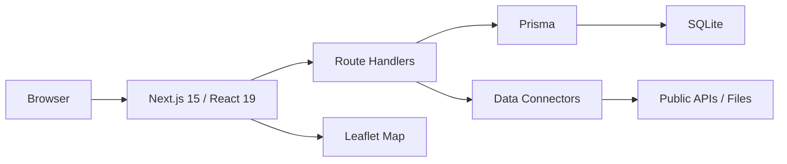
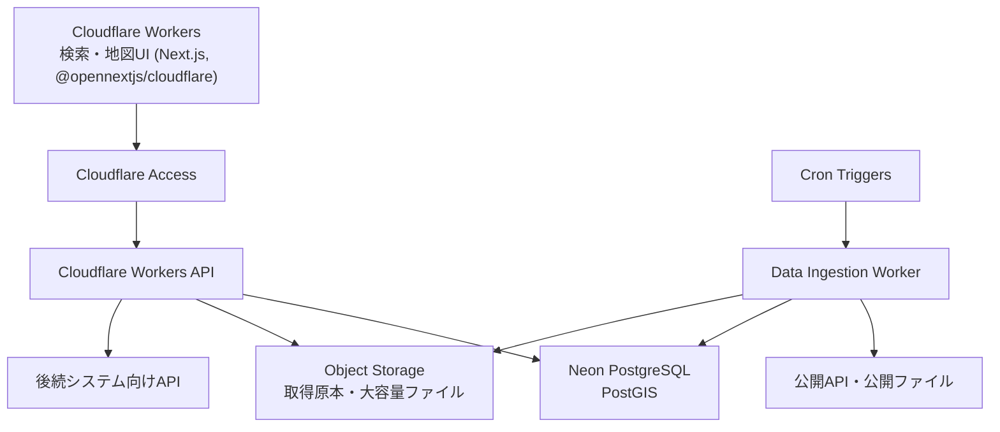
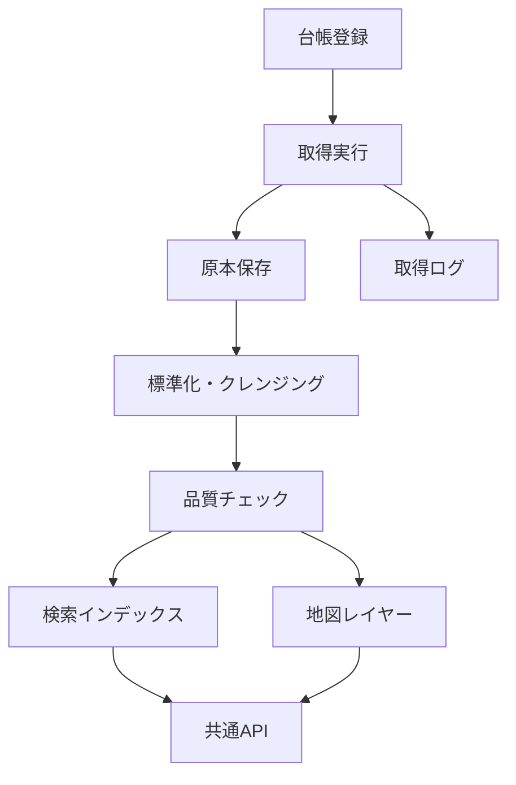

# システムアーキテクチャ

## 1. アーキテクチャ方針

CODIPは、公開データの「調査台帳」から始め、取得、標準化、地図、後続APIへ拡張する。現行MVPは開発速度を優先したNext.js一体構成、将来本番はCloudflareとNeon/PostGISを使う分散構成とする。

## 2. 現行MVP構成

| レイヤー | 技術 | 役割 |
| --- | --- | --- |
| UI | Next.js, React, TypeScript | 画面、フォーム、一覧、地図 |
| API | Next.js Route Handlers | 台帳、検索、取得、品質再計算 |
| DB | SQLite, Prisma | MVPの正本データ |
| 地図 | Leaflet, 地理院タイル | 2D地図表示 |
| テスト | Vitest, Playwright | 単体・E2E |

## 3. 将来本番構成

## 4. モジュール分割

| モジュール | 責務 |
| --- | --- |
| データソース・カタログ | 提供元、URL、形式、利用条件、品質状態の管理 |
| 取得・コネクタ | API/ファイル取得、サンプル取得、疎通確認 |
| 標準化 | 共通メタデータ、座標系変換、項目マッピング |
| 検索 | キーワード、カテゴリ、地域、範囲検索 |
| 地図 | レイヤー表示、属性確認、範囲指定 |
| 品質 | 鮮度、完全性、公式性、ライセンス、取得性の評価 |
| 後続API | 他システムへ共通形式でデータを提供 |
| AI支援 | 検索補助、要約、候補提示、差分整理 |

## 5. データフロー

## 6. 設計判断

| 判断 | 理由 |
| --- | --- |
| MVPはNext.js一体構成 | 小さく早く検証し、画面とAPIを同時に改善できる |
| DBはSQLiteから開始 | ローカル開発とCIが軽い |
| 将来はPostGISへ移行 | 地点検索、範囲検索、ポリゴン重複判定が必要 |
| コネクタ方式 | 公開元ごとの差異を局所化する |
| 3Dは将来分離 | MVPの成立性確認を2D地図とGeoJSONに集中する |

