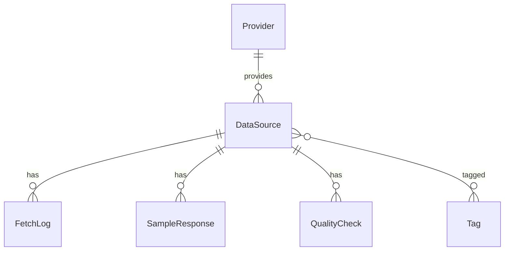

# データモデル・データベース設計

## 1. 方針

CODIPのデータモデルは、すべての公開データを1つの表に押し込むのではなく、共通メタデータと分野別属性を分ける。



## 2. 現行MVPテーブル

| テーブル | 内容 |
| --- | --- |
| `providers` | 提供機関 |
| `data_sources` | API・公開データ台帳 |
| `tags` | タグ |
| `data_source_tags` | 多対多関連 |
| `fetch_logs` | 接続確認・取得ログ |
| `sample_responses` | サンプルレスポンス |
| `quality_checks` | 品質評価履歴 |
| `related_use_cases` | 後続利用候補 |

## 3. 共通データモデル

標準化後のレコードは次の共通項目を持つ。

```text
record_id
source_id
source_record_id
category
title
description
prefecture_code
municipality_code
address
geometry
observed_at
published_at
retrieved_at
valid_from
valid_to
source_url
license_id
quality_status
raw_data_reference
properties
```

## 4. PostgreSQL/PostGIS標準レコードMVP

| テーブル | 内容 |
| --- | --- |
| `standard_records` | 実装済み。標準化済み共通レコード、PostGIS geometry、JSONB属性 |
| `standard_record_versions` | 将来。差分・履歴 |
| `raw_objects` | 将来。原本ファイル参照 |
| `licenses` | 台帳側に実装済み。PostgreSQL正本化時に拡張 |
| `source_schemas` | 将来。公開元の項目定義 |
| `field_mappings` | 将来。公開元項目と共通項目の対応 |
| `ingestion_jobs` | 将来。取得ジョブ |
| `ingestion_job_logs` | 将来。ジョブログ |

PostgreSQL/PostGIS移行用の資材として、`prisma/postgresql/schema.prisma` と `prisma/postgresql/migrations/20260713113000_init/migration.sql` を管理する。現行SQLite実装を壊さず、CIとPostGIS previewで次を検証する。

| 項目 | 検証 |
| --- | --- |
| 中核モデルの整合 | `npm run db:compare-schemas` |
| PostgreSQL schema構文 | `npm run db:pg:validate` |
| PostgreSQL Prisma Client生成 | `npm run db:pg:generate` |
| PostGIS有効化 | migration SQLの `CREATE EXTENSION IF NOT EXISTS postgis` |
| 標準レコード | `standard_records.geometry geometry(Geometry,4326)` |
| 標準レコード読取 | PostgreSQL/PostGIS環境では `/api/v1` が `standard_records` を読取可能。CIでseed済み標準レコードsmokeを実行 |
| Preview方針 | SQLite previewは台帳中心。`standard_records` がない場合は `catalog_only` / `not_standardized` へフォールバック |

`/api/v1/records/search`、`/api/v1/records/point`、`/api/v1/layers`、`/api/v1/layers/{id}/features` は、PostgreSQL/PostGISで `standard_records` が存在する場合に標準化済み地物を返す。未投入またはSQLite previewでは、従来どおり台帳メタデータのみを返し、`not_standardized` または `catalog_only` を明示する。

本番でPostgreSQLを使うには、PostgreSQL schemaを正本へ昇格し、migration/seedをone-off release jobで実行する。Cloudflare/Neon実環境、原本保存先、実データ投入手順はstaging導入時にリリース証跡へ追加する。

## 5. 空間データ

| 項目 | 仕様 |
| --- | --- |
| 内部座標系 | 原則 `EPSG:4326` |
| 点 | 観測所、施設、事故地点 |
| 線 | 道路、河川、鉄道 |
| 面 | 行政区域、浸水区域、用途地域 |
| 独自属性 | JSONB `properties` |
| 元座標系 | 変換前の座標系をメタデータに保持 |
| 変換履歴 | 変換日時、処理バージョン、変換ライブラリを保持 |

## 6. インデックス設計案

| 用途 | インデックス |
| --- | --- |
| 台帳検索 | `category`, `provider_id`, `data_format`, `status` |
| 鮮度確認 | `last_checked_at`, `retrieved_at`, `published_at` |
| 取得ログ保持 | `fetch_logs(data_source_id, executed_at)`, `fetch_logs(executed_at)` |
| サンプル保持 | `sample_responses(data_source_id, created_at)`, `sample_responses(created_at)` |
| 地点検索 | PostGIS `GIST(geometry)` |
| 行政区域検索 | `prefecture_code`, `municipality_code` |
| 後続APIページング | `source_id`, `record_id`, `retrieved_at` |

## 7. データ保持

| データ | 保持方針 |
| --- | --- |
| 台帳 | 正本として永続保持 |
| 取得ログ | MVPでは永続保持。本番では保存期間を設定 |
| サンプルレスポンス | サイズ制限を設けて保存 |
| 原本ファイル | オブジェクト保存領域に保存 |
| 秘密情報 | DBに保存しない。環境変数名のみ保持 |
