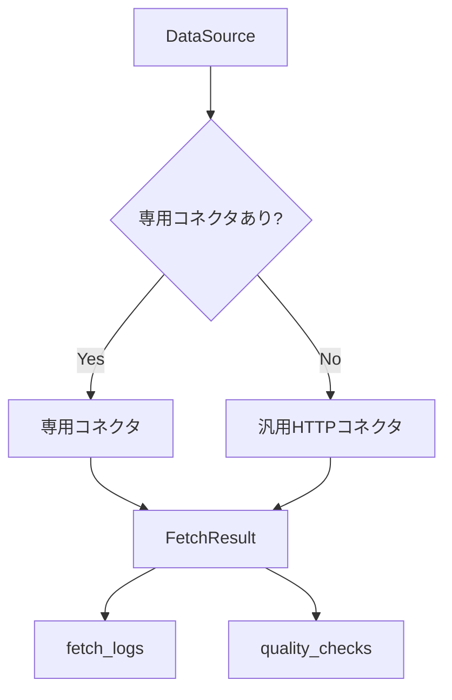

# データ取得・コネクタ設計

## 1. 目的

公開元ごとの差異をコネクタに閉じ込め、CODIP本体は共通の取得結果、ログ、品質評価を扱う。

## 2. 取得方式

| 方式 | 例 | 備考 |
| --- | --- | --- |
| API | JSON、XML、GeoJSON API | 認証、レート制限に注意 |
| ダウンロード | ZIP、CSV、Shapefile | 原本保存と展開処理が必要 |
| タイル | 地図タイル、ベクトルタイル | 直接再配布条件を確認 |
| Webページ | HTML、PDFリンク | スクレイピングではなく公開情報確認を基本 |
| 手動 | 調査メモ | 自動取得できないものを台帳化 |

## 3. コネクタ選択



## 4. 取得ログ項目

| 項目 | 内容 |
| --- | --- |
| `executionType` | `check` または `sample` |
| `requestUrl` | 取得対象URL |
| `method` | HTTPメソッド |
| `statusCode` | HTTPステータス |
| `success` | 成功可否 |
| `responseTimeMs` | 応答時間 |
| `responseSizeBytes` | レスポンスサイズ |
| `contentType` | Content-Type |
| `errorType` | timeout, network, invalid_url等 |
| `errorMessage` | 秘密情報を除いたエラー内容 |
| `executedAt` | 実行日時 |

## 5. 原本保存

本番構成では、取得したZIP、GeoJSON、CSV、XML、PDF等をオブジェクト保存領域に保存する。保存キーには、データソースID、取得日、処理バージョンを含める。

例:

```text
raw/source_id=ksj_admin_area/retrieved_date=2026-07-13/version=v1/original.zip
```

## 6. リトライ方針

| エラー | リトライ | 備考 |
| --- | --- | --- |
| 5xx | する | 指数バックオフ |
| timeout | する | 最大回数を制限 |
| 429 | する | `Retry-After` を尊重 |
| 401/403 | しない | 認証設定を確認 |
| 404 | しない | URL変更または公開終了として扱う |
| parse_error | しない | 仕様変更疑いとして記録 |

## 7. クレンジング方針

| 処理 | 方針 |
| --- | --- |
| 文字コード | UTF-8へ正規化 |
| 日時 | ISO8601へ正規化 |
| 座標 | 内部は`EPSG:4326`へ変換 |
| コード | 都道府県・市区町村コードを標準化 |
| 欠損 | 推測補完しない。欠損として記録 |
| 独自項目 | `properties`へ保持 |

