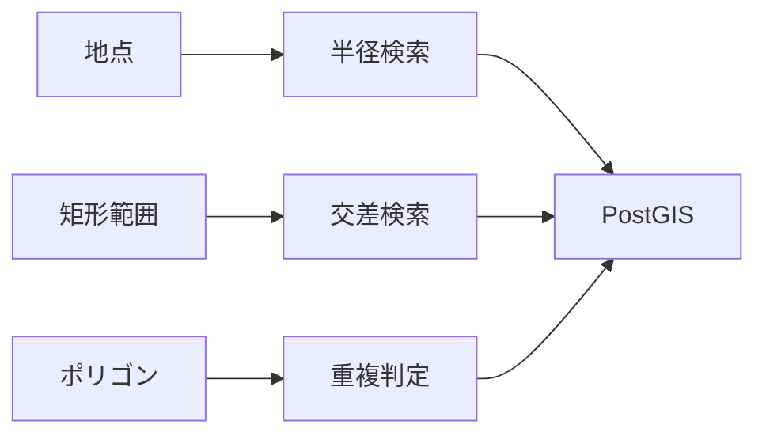

# 地理空間・地図設計

## 1. 対象

MVPでは2D地図とGeoJSON表示を対象とする。PLATEAU等の3D都市モデルは将来フェーズで扱う。

## 2. レイヤー種別

| 種別 | 例 |
| --- | --- |
| 点 | 医療機関、観測所、避難所 |
| 線 | 道路、河川、鉄道 |
| 面 | 行政区域、土砂災害警戒区域、浸水想定区域、用途地域 |
| ラスター | 背景地図、標高タイル |

## 3. 地図機能

| 機能 | MVP | 将来 |
| --- | --- | --- |
| 背景地図 | 地理院タイル | 複数背景切替 |
| GeoJSON表示 | 対応 | 大容量は簡略化 |
| レイヤー切替 | 対応 | 権限・用途別プリセット |
| クリック地点の標高表示 | 対応 | 履歴・ブックマーク |
| GeoJSON属性ポップアップ | 将来 | 複数レイヤー重なり表示 |
| 住所検索 | 候補 | ジオコーディング連携 |
| 緯度経度検索 | 対応 | 履歴・ブックマーク |
| 範囲検索 | 候補 | PostGISで本格対応 |
| 3D表示 | 対象外 | PLATEAU連携 |

## 4. 将来PostGIS空間検索

| 検索 | SQL/PostGIS例 |
| --- | --- |
| 範囲内 | `ST_Within(geometry, bbox)` |
| 交差 | `ST_Intersects(geometry, area)` |
| 距離 | `ST_DWithin(geometry, point, radius)` |
| 面積 | `ST_Area(geometry)` |
| 簡略化 | `ST_SimplifyPreserveTopology(geometry, tolerance)` |

## 5. 出典表示

地図上の結果には必ず次を表示する。

| 項目 | 理由 |
| --- | --- |
| 提供元 | 公式性確認 |
| 原典URL | 追跡性 |
| データ基準日 | 鮮度確認 |
| 取得日時 | CODIP側の更新確認 |
| ライセンス | 利用条件確認 |
| 品質状態 | 利用前の注意喚起 |
