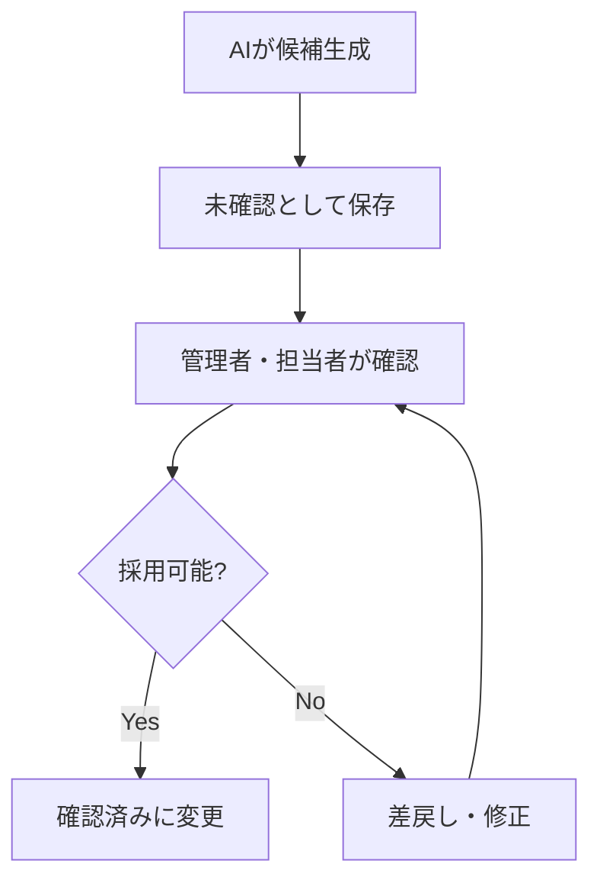

# AI機能ガバナンス

## 1. 位置付け

AIはCODIPの主役ではなく、検索支援、要約、分類候補提示、ログ原因整理を補助する機能として扱う。

## 2. 有効なAI機能

| 機能 | 内容 |
| --- | --- |
| 説明文要約 | データセット説明を短く整理 |
| 類似候補提示 | 似たデータソースを提示 |
| 自然文検索 | 自然文を検索条件に変換 |
| API仕様解析 | 項目候補を抽出 |
| 項目マッピング | 公開元項目と共通項目の対応候補 |
| エラー整理 | エラーログの原因候補を整理 |
| 差分要約 | 更新内容の概要を作成 |
| 確認案内 | 目的に対して見るべきデータを案内 |

## 3. AIに任せないもの

| 禁止事項 | 理由 |
| --- | --- |
| 施工可能・不可能の決定 | 専門判断が必要 |
| 安全性の保証 | 責任範囲外 |
| 災害発生の断定 | 予測・断定は危険 |
| 法令適合の最終判断 | 有資格者・担当者が確認 |
| 出典不明データの補完 | 事実性を損なう |
| 欠損値の事実化 | 誤データになる |
| 座標や数値の推測入力 | 空間判断に重大影響 |

## 4. AI生成メタデータ

AIが生成した内容には次を保持する。

| 項目 | 内容 |
| --- | --- |
| AI生成フラグ | AI生成かどうか |
| 利用モデル | モデル名 |
| 生成日時 | ISO8601日時 |
| 根拠データ | 入力に使った原典 |
| 確認状態 | 未確認、確認済み、差戻し |
| 修正履歴 | 人による修正内容 |

## 5. 承認フロー

