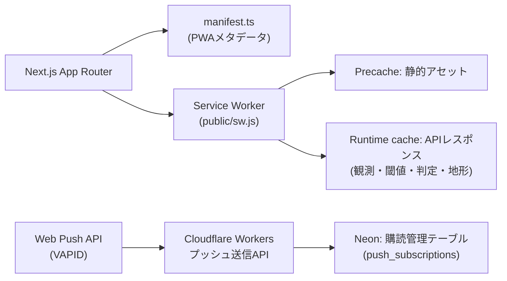

# 📱 PWA・モバイル対応 設計書（Design）

> 🗓️ 2026-08-10 ｜ 状態: 設計着手（Phase 1）｜ 正本: 本ファイル

---

## 1. 目的と対象

現場（タブレット・スマートフォン）で、CODIPの地形分析・気象海象判定・現場管理・レポートを、通信が不安定な環境でも利用できるようにする。

| 対象 | 要件 |
| --- | --- |
| 現場監督・技術者 | 現場選択→気象海象確認→判定確認を3タップ以内で |
| 協力会社 | 共有URL・レポートの閲覧（認証済み） |
| 本社・経営 | ダッシュボード・レポートのモバイル閲覧 |

## 2. 方針

- 📱 **PWA（インストール可能）**: ストア配布なしで導入できる
- 🧭 **オフラインファースト**: 直近観測・閾値・判定結果・地形レポートを端末へキャッシュ
- 🔔 **プッシュ通知**: 警報・閾値超過・判定変更を現場へ通知（オプトイン）
- 🔐 **既存認証を維持**: Cloudflare Access + 管理セッションの範囲で実装。PWA自体に新たな認証基盤を持たない

## 3. アーキテクチャ

### 3.1 コンポーネント

| コンポーネント | 実装 | 備考 |
| --- | --- | --- |
| `src/app/manifest.ts` | Next.js Metadata API | name/short_name/theme_color/icons（`public/icon.svg`） |
| `public/sw.js` | Service Worker | プリキャッシュ＋APIキャッシュ＋オフラインfallback |
| 登録スクリプト | `src/lib/pwa/register.ts` | プロダクション時のみ登録 |
| プッシュ購読API | `src/app/api/v1/push/subscriptions` | POST（購読登録）/ DELETE（解除） |
| 送信API | 管理操作 | 判定・閾値・警報イベント時に管理者が送信（自動はPhase 3） |
| オフラインDB | IndexedDB（idb） | 直近200観測・閾値・判定スナップショット |

## 4. 画面設計（モバイル）

| 画面 | 構成 | オフライン |
| --- | --- | --- |
| 現場ホーム（`/sites`） | 現場カード一覧→現場選択 | ✅ 直近キャッシュ |
| 気象海象（`/weather`） | 観測カード→風配図→週間予報 | ⚠️ 予報はオンライン時のみ |
| 判定（`/decisions`） | 作業種別→判定実行→根拠表示 | ✅ 直近判定を表示 |
| 地形（`/terrain`） | 地点検索→DEM分析→共有URL | ⚠️ 分析結果キャッシュ |
| レポート（`/reports`） | テンプレート→CSV/Markdown | ⚠️ 生成はオンライン時 |

## 5. オフライン戦略

| 種別 | 戦略 |
| --- | --- |
| 静的アセット | `cache-first`（プリキャッシュ） |
| `/api/v1/observations/*` `/api/v1/thresholds` | `stale-while-revalidate`（TTL 15分） |
| `/api/v1/terrain/*` | `network-first`＋成功時キャッシュ（TTL 24h） |
| `/api/v1/decisions` | 書き込みはオンライン必須。結果はローカル履歴に保存 |
| 非対応 | 週間予報・外部タイル（GSI/OSM）はオンライン時のみ |

## 6. プッシュ通知設計

| 項目 | 設計 |
| --- | --- |
| 技術 | Web Push API + VAPID（`applicationServerKey`） |
| 購読管理 | `push_subscriptions`（userId/endpoint/p256dh/auth/createdAt）をNeonへ保存。秘密鍵はWorker Secret |
| 通知種別 | ①警報・注意報 ②閾値超過 ③判定結果（go/caution/stop）④データ更新遅延 |
| 送信 | 管理APIから対象現場の購読者へ送信。自動トリガーはPhase 3 |
| オプトイン | ブラウザ許可＋設定画面で現場単位の購読管理 |
| 権限 | 送信APIは管理認証必須・レート制限・監査ログ |

## 7. セキュリティ・アクセシビリティ

- 🔐 VAPID秘密鍵・購読エンドポイントはSecrets/DB管理（Git保存禁止）
- 🔐 プッシュ購読APIは同一Origin・管理セッションの範囲で実施
- ♿ タッチターゲット44px以上・コントラストWCAG AA・フォントサイズ設定に追従
- 📱 viewport/セーフエリア対応・横画面レイアウト
- 🚫 オフラインキャッシュに個人情報・APIキーを保存しない

## 8. 実装タスク（Phase 1・3か月）

| # | タスク | 難易度 | 工数目安 | 完了基準 |
| --- | --- | --- | --- | --- |
| 1 | `manifest.ts`＋アイコン | 低 | 0.5人日 | Lighthouse PWAインストール可能 |
| 2 | Service Worker登録・プリキャッシュ | 中 | 2人日 | オフラインで主要画面表示 |
| 3 | APIキャッシュ戦略 | 中 | 2人日 | 観測・閾値・判定のSWR動作 |
| 4 | 現場選択のモバイルUI最適化 | 中 | 2人日 | 3タップで判定到達 |
| 5 | プッシュ購読・送信API | 高 | 4人日 | 購読→テスト通知→解除のE2E |
| 6 | オフライン判定履歴 | 中 | 2人日 | 圏外で直近判定を閲覧 |
| 7 | アクセシビリティ監査（axe） | 低 | 1人日 | CIにaxeチェック導入 |

## 9. スコープ外（Phase 3以降）

- プッシュ通知の自動トリガー（気象警報連携）
- ネイティブアプリ化（Capacitor/Expo）は、PWA評価後に判断
- 協力会社向け限定公開（マルチテナント）

## 10. リスク

| リスク | 対策 |
| --- | --- |
| Service Workerのキャッシュ更新不整合 | バージョン管理＋`skipWaiting`＋更新通知 |
| プッシュ通知の乱用・迷惑 | 現場単位購読・送信履歴の監査・頻度制限 |
| Web Pushの配信信頼性 | 配信結果（success/failed）を記録し、失敗時はリトライ |
| Cloudflare WorkersでのVAPID計算 | Web Crypto API対応（Node非依存実装） |
