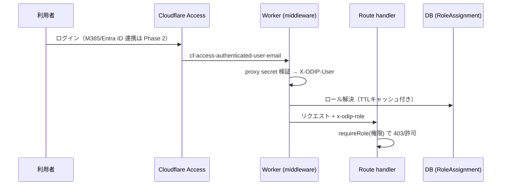

# RBAC 基本設計（Phase 1 着手）

> 2026-08-12 作成 ｜ ステータス: 設計（実装は Phase 1） ｜ 関連: 要件定義 docs/01、セキュリティ docs/09、AIガバナンス docs/10

## 1. 目的とスコープ

CODIP は本番稼働中のデータ基盤であり、2026-08-12 時点の認証は **Cloudflare Access（前段）＋ proxy 認証注入（`X-ODIP-User`）** を正本とする。管理者操作は `CODIP_TRUST_PROXY_SECRET` とメール allowlist で fail-closed に保護されている（PR #120 / docs/09）。

本設計の目的は、**600名規模（現場・本社・経営層・協力会社）で誰が何をできるか**をロール単位で定義し、既存の Access 認証を壊さずに段階実装できる基盤を用意することである。

対象外（本設計では扱わない）:

- Entra ID との SSO 実装（連携仕様のみ記述。実装は Phase 2）
- 協力会社向け外部テナント（Phase 3〜4）
- データ提供 API の外部公開（Phase 4）

## 2. ユーザー分類とロール

| ロール | 想定ユーザー | 主な用途 |
| --- | --- | --- |
| `viewer`（閲覧者） | 現場スタッフ・経営層・協力会社 | 検索・地図・地形・気象・判定結果の閲覧、共有URL |
| `engineer`（技術者） | 土木技術者・現場管理者 | viewer + 現場登録・判定実行・レポート出力・ウォッチリスト |
| `data-steward`（データ管理者） | IT/DX部門・データ担当 | engineer + データソース登録・収集ジョブ管理・品質再計算 |
| `admin`（管理者） | IT/DX部門（7名） | data-steward + 管理API・設定・タグ・監査ログ参照 |
| `auditor`（監査） | 監査・コンプライアンス担当 | 監査ログ・判定スナップショット・証跡の参照のみ（変更不可） |
| `api-consumer`（API利用者） | 後続システム | 契約済みAPIキー経由で read / 限定 write |

既定は `viewer`。全ロールは **deny-by-default** とし、ロールに無い権限は403を返す。

## 3. 権限マトリクス（初期版）

| 機能 | viewer | engineer | data-steward | admin | auditor | api-consumer |
| --- | :---: | :---: | :---: | :---: | :---: | :---: |
| 台帳・検索・地図・地形・気象・判定結果の閲覧 | ✅ | ✅ | ✅ | ✅ | ✅ | ✅（API） |
| 判定実行・現場登録 | ❌ | ✅ | ✅ | ✅ | ❌ | 契約次第 |
| レポート出力（CSV/Excel/PDF） | ❌ | ✅ | ✅ | ✅ | ✅ | 契約次第 |
| ウォッチリスト・通知設定 | ❌ | ✅ | ✅ | ✅ | ❌ | ❌ |
| データソース登録・編集 | ❌ | ❌ | ✅ | ✅ | ❌ | ❌ |
| 収集ジョブ管理・品質再計算 | ❌ | ❌ | ✅ | ✅ | ❌ | ❌ |
| タグ管理・アプリ設定 | ❌ | ❌ | ❌ | ✅ | ❌ | ❌ |
| 管理API（fetch-logs等） | ❌ | ❌ | ❌ | ✅ | ❌ | ❌ |
| 監査ログ参照 | ❌ | ❌ | ❌ | ✅ | ✅ | ❌ |
| APIキー発行・失効 | ❌ | ❌ | ❌ | ✅ | ❌ | ❌ |
| 権限付与（ロール管理） | ❌ | ❌ | ❌ | ✅ | ❌ | ❌ |

## 4. 認証・認可フロー



### 4.1 ロール解決の正本

- 正本: `RoleAssignment` テーブル（userEmail, roleId, scope, expiresAt）
- キャッシュ: 60秒 TTL（`src/lib/ttl-cache.ts` を再利用）。失敗時は fail-closed（未解決=viewer既定、ただし管理系は403）
- 管理系の閾値: `admin` 未解決の場合は現行どおり fail-closed（403）

### 4.2 既存認証との両立

| 経路 | 現行 | 本設計後 |
| --- | --- | --- |
| Access + proxy secret | 正本（`CODIP_DISABLE_TOKEN_AUTH=true`） | 不変。`X-ODIP-User` からロール解決 |
| 管理者トークン | テスト/開発用 | 残置（`CODIP_DISABLE_TOKEN_AUTH=false` 時のみ）。本番は proxy 正本 |
| APIキー | 未実装 | `api-consumer` 用に Phase 2 で導入（`ApiKey` テーブル + 監査） |

## 5. データモデル案

```prisma
model Role {
  id        String   @id @default(cuid())
  name      String   @unique // viewer / engineer / data-steward / admin / auditor / api-consumer
  priority  Int      @default(100)
  note      String?
  createdAt DateTime @default(now())
  assignments RoleAssignment[]
}

model RoleAssignment {
  id        String   @id @default(cuid())
  userEmail String // 小文字正規化
  roleId    String
  role      Role     @relation(fields: [roleId], references: [id])
  scope     String   @default("global") // global / site:<id> / provider:<id>
  grantedBy String
  expiresAt DateTime?
  createdAt DateTime @default(now())
  revokedAt DateTime?

  @@index([userEmail, revokedAt])
  @@unique([userEmail, roleId, scope, revokedAt])
}
```

判断ポイント:

- `scope` を最初から持つことで、現場単位・提供元単位の限定付与を将来追加できる（協力会社向け）
- `expiresAt` / `revokedAt` により一時権限（工事期間限定）と失効監査を可能にする
- ロール変更は `audit-events`（既存 `AuditLog`）へ必ず記録する

## 6. 実装方針（Phase 1）

### 6.1 段階

1. **スキーマ追加**: `Role` / `RoleAssignment` migration（SQLite/PostgreSQL両対応、PostGIS互換CIでdrift検査）
2. **ロール解決モジュール**: `src/lib/rbac.ts`（`resolveRole(userEmail)`、`requireRole(required, ctx)`、TTLキャッシュ）
3. **ミドルウェア拡張**: `X-ODIP-User` から `x-odip-role` を注入（管理系は admin 必須を維持）
4. **ルートガード置換**: 管理API・変更系APIを `requireRole` へ順次移行（まず `/api/admin/*` と `/api/sources` POST/PATCH）
5. **管理UI**: `/settings` にロール割当画面（adminのみ）＋監査イベント出力
6. **テスト**: ロール別アクセス行列のE2E（viewer/engineer/data-steward/admin/auditor）、TTLキャッシュ、失効・期限切れ、fail-closed

### 6.2 完了基準

- 権限マトリクス上の全セルが正常/異常系テストで検証済み
- 未認証・未解決ロールは全変更系で403
- ロール変更・失効が監査ログへ記録される
- `npm run lint` / `typecheck` / `test` / build / 契約ゲート全pass

## 7. Entra ID 連携（Phase 2 以降）

- Cloudflare Access が Entra ID を IdP として利用する構成（既存 M365 環境と整合）を推奨
- グループ（例: `CODIP-Admin`、`CODIP-Engineer`）を Access policy と `RoleAssignment` の両方へマッピング
- 個人メールに依存せずグループ主導でロール更新できるようにする（運用負荷低減）
- 連携導入時も `proxy-auth-inject` の検証経路は不変とし、IdP変更の影響範囲を限定する

## 8. リスクと対策

| リスク | 対策 |
| --- | --- |
| ロール解決失敗で全ユーザーが締め出し | fail-closed を維持しつつ、viewer相当の閲覧は許可（管理・変更系のみ403）。ロール解決エラーを監視ログへ |
| 権限昇格（誤設定） | ロール変更は admin のみ＋監査ログ強制。テストで昇格経路を検証 |
| 既存 Access 認証の回帰 | proxy-auth-inject の既存テスト（4件）を維持し、ロール解決を追加する形で拡張 |
| 600名分のメンテ工数 | グループ連携（Phase 2）まで `RoleAssignment` を CSV/管理UIで運用し、期限付き付与で棚卸し |

## 8.5 ウォッチリストUI（Phase 1 実装・2026-08-13）

権限マトリクスの「ウォッチリスト・通知設定」を UI まで垂直スライスで実装した。

- **画面**: `/watchlist`（一覧・追加・一時停止・再開・解除）。現場一覧（`/sites`）と
  データソース詳細に `WatchToggle` を配置
- **API**: `GET/POST /api/v1/watchlist`、`DELETE/PATCH /api/v1/watchlist/{id}`。
  PATCH で `enabled` を切替え、日次の通知ダイジェスト（`scripts/ingestion/notification-check.js`）は
  `enabled=true` の登録のみ対象にする
- **識別子**: 本番は Access の `cf-access-authenticated-user-email` を信頼境界検証して利用。
  ローカル/共有preview は `CODIP_DEMO_IDENTITY=true` + `CODIP_DEMO_USER_EMAIL` の明示 opt-in
  （`src/lib/demo-identity.ts`）で、管理セッション認証済みリクエストに限りデモ識別子へ落とす。
  どちらかの変数が欠ければ既存どおり 401 で fail-closed
- **個人単位の隔離**: 全操作は `userEmail` でスコープし、他ユーザーの登録は参照・変更できない
  （`where: { id, userEmail }` / 複合一意キー）
- **監査**: add / remove / toggle を `auditLog` へ記録
- **seed**: `prisma/seed.ts` が `demo.engineer@example.com` 向け登録（現場・データソース各1件）と
  デモRBAC割当を投入（本番 DB の seed 経路では投入しない）

## 9. 参照

- docs/09-security-and-compliance.md（既存セキュリティ設計）
- src/lib/proxy-auth-inject.ts / src/middleware.ts（認証注入の現行実装）
- docs/design/pwa-mobile-design.md（UI連携）
