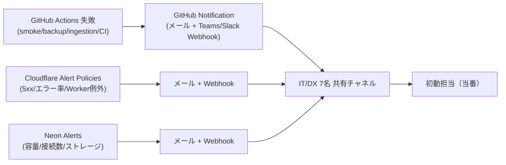

# 🔔 アラート・通知設定 Runbook

> 🗓️ 最終更新: 2026-08-10 ｜ 状態: **通知先・通知テストは未設定（2026-08-10時点）** ｜ 正本: 本ファイル＋[運用台帳](../operations/operations-ledger.md)

CODIPの障害検知（Production Smoke 15分毎・Neonバックアップ日次・データ収集10/30分毎）はGitHub Actionsで自動実行されているが、**失敗時に誰へ通知するかは未設定**。本Runbookは、少人数（IT/DX 7名）で確実に気づける通知経路を確立するための手順書である。

---

## 1. 現状（2026-08-10）

| 監視対象 | 頻度 | 検知 | 通知 |
| --- | --- | --- | --- |
| 本番health/ready | 15分 | ✅ Production Smoke（`post-release-status --strict-production`） | ❌ 未設定 |
| Neonバックアップ | 日次 03:17 JST | ✅ `neon-backup.yml` | ❌ 未設定 |
| データ収集 | 10/30分 | ✅ `data-ingestion.yml` / `data-ingestion-weather.yml` | ❌ 未設定 |
| CI/ビルド | PR/merge毎 | ✅ `ci.yml` | ❌ 未設定（失敗はActions画面のみ） |
| Workersエラー | 日次確認 | ✅ Workers Logs/Traces（手動） | ❌ 未設定 |
| Neon容量・接続 | 月次確認 | ❌ 手動予定 | ❌ 未設定 |

**結論**: 監視自体は稼働しているが、障害の「気づき」が人間の画面確認に依存しており、24時間の無人検知が成立していない。本Runbookの手順を実施して通知経路を確立することをP0とする。

---

## 2. 目標構成

## 3. 設定手順

### 3.1 GitHub Actions 失敗通知（即時実施・最小構成）

1. 通知先の決定（人間承認）
   - メール: IT/DX部門共有メールボックス（例: `it-dx@mirai-const.co.jp`）
   - チャット: Microsoft Teams チャネルWebhook（Microsoft 365環境に整合）
2. GitHub Repository Settings → Notifications で失敗通知のメール設定を確認
3. 各ワークフロー（`production-smoke.yml` / `neon-backup.yml` / `data-ingestion.yml` / `data-ingestion-weather.yml` / `ci.yml`）の失敗時に通知するジョブを追加
   - メール: `actions/github-script` で Issue 起票＋`@dependabot` 等ではなく、運用台帳のエスカレーション先へ
   - Teams: `dcr-jrndm/workflow-teams-notify` 等のSHA固定Action（レビュー後に採用）またはWebhook呼び出し
4. **通知テスト**: 意図的に失敗するテストrun（例: 存在しないURLをprobe）を `workflow_dispatch` で実行し、受信を確認。テスト後は通常設定へ戻す

### 3.2 Cloudflare Alert Policies

1. Cloudflare Dashboard → Notifications → Alert Policies を開く
2. 最低限、以下を作成する:

| Policy名 | 種別 | 閾値 | 通知先 |
| --- | --- | --- | --- |
| CODIP Worker 5xx | HTTP traffic anomaly / 5xx | 連続5件 or 1分で10件 | メール＋Webhook |
| CODIP Worker exception | Workers exception | 1件以上 | メール＋Webhook |
| CODIP Zone down | zone down | 即時 | メール＋Webhook |

3. 通知先へWebhook用の署名シークレットを設定し、Gitへ保存しない
4. **通知テスト**: 通知先へのテスト配信（Dashboardの「Send test notification」）を実施し、受信を記録

### 3.3 Neon Alerts

1. Neon Console → Project → Settings → Notifications を開く
2. 以下を設定:
   - Storage usage 80%
   - Connection limits 80%
   - Compute active hours（コスト監視）
3. 通知先: メール＋Webhook（Cloudflare/Teamsと同一チャネル推奨）

### 3.4 エスカレーション基準（運用台帳 §0 と連携）

| レベル | 検知 | 初動 | 通知 |
| --- | --- | --- | --- |
| P1 | 本番ダウン・DB接続不可・バックアップ2日連続失敗 | 15分以内 | 即時: メール＋Teams |
| P2 | Smoke不安定・データ収集停滞・容量80% | 30分以内 | 即時: メール＋Teams |
| P3 | CI失敗・既知の警告・月次点検項目 | 1営業日 | 日次ダイジェスト |

---

## 4. 月次通知試験（運用台帳 §3.3 と連携）

| 項目 | 方法 | 合格基準 |
| --- | --- | --- |
| メール | テスト配信 | 共有メールボックスで受信確認 |
| Teams Webhook | テスト投稿 | 共有チャネルで受信確認 |
| Cloudflare Policy | Send test notification | 受信確認 |
| Neon Alert | テストアラート | 受信確認 |
| GitHub Actions | 意図的失敗run | 受信確認 |

実施後は、`CODIP_CLOUDFLARE_ALERT_POLICY` と `CODIP_MONITORING_CONTACTS` の証跡変数を更新し、運用台帳「実行記録」へ追記する。

---

## 5. 未実施のまま運用する場合のリスク（受容条件）

通知未設定のまま運用を継続する場合は、以下を**明示的に受容**する必要がある。

- 🔴 障害検知から人間の認知まで最大で「次の手動確認まで」遅延する
- 🔴 夜間・休日・連休中の長期障害に気づけない
- 🟡 バックアップ失敗（2026-08-06実績）が翌日まで気づかれない可能性

受容しない場合は、§3の手順をP0として実施する。
