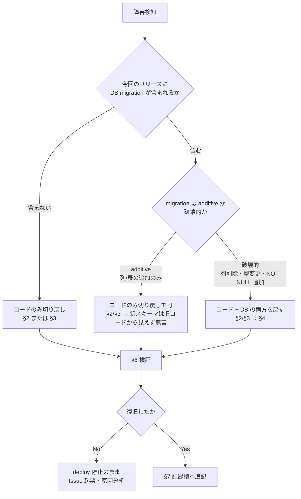

# 🔙 ロールバック Runbook

障害発生時に**その場でコピー&ペーストして実行できる**切り戻し手順をまとめる。
`docs/13-deployment-and-operations.md` §4 障害対応、`docs/runbooks/cloudflare-production.md` §4、`docs/runbooks/cloudflare-neon-staging.md` §5、
`docs/runbooks/database-deployment.md` §6 が示す「どう戻すか」の方針に対し、本書は「実際のコマンド」を担う。

---

## ⚠️ 0. 適用範囲と承認境界

| 区分 | 内容 |
| --- | --- |
| 対象 | 共有プレビュー / staging / production |
| 実行者 | **人間**。ロールバックは本番状態を変更するため、AI エージェントは判断材料の提示までとし実行しない |
| 事前確認 | 本書の各手順は「影響」「不可逆性」を明記している。実行前に必ず読むこと |
| 記録 | 実行後は §7 の記録欄と該当 Issue に、実行者・時刻・対象・結果を残す |

> 🚨 **最重要**: アプリケーションのロールバックは **DB をロールバックしない**。
> スキーマ変更を含むリリースを戻す場合、コードだけ戻すと「新スキーマ + 旧コード」という
> 未検証の組み合わせになる。必ず §1 の判断フローで先に種別を確定させること。

---

## 🧭 1. 判断フロー: どのロールバックが必要か



| 判定 | 根拠の確認方法 |
| --- | --- |
| migration の有無 | `git diff <戻す先タグ>..<現在タグ> -- prisma/postgresql/migrations/` に差分があるか |
| additive か破壊的か | 該当 migration の `.sql` を開き、`DROP`／`ALTER ... TYPE`／`SET NOT NULL`／`RENAME` の有無を確認 |

---

## ☁️ 2. Cloudflare Workers のロールバック

> 適用: Workers へデプロイ済みの場合。2026-08-01時点で `codip-production` は稼働中だがDB経路が503で、最新mainのWorkers wasm修正が未デプロイ。既知の正常な旧Worker versionは確認できないため、無根拠なrollbackより承認済みCI/CDからの最新main再デプロイを優先する。

### 2.1 現在の状態を確認する

```bash
npx wrangler deployments status --name codip --env production
npx wrangler deployments list --name codip --env production
npx wrangler versions list --name codip --env production
```

### 2.2 直前バージョンへ戻す

```bash
# 直前のバージョンへ戻す (VERSION_ID 省略時は「最新の1つ前」が対象)
npx wrangler rollback --name codip --env production --message "incident: <Issue番号> による切り戻し"

# 特定バージョンを指定して戻す
npx wrangler rollback <VERSION_ID> --name codip --env production --message "incident: <Issue番号> による切り戻し"
```

`--message` を指定すると対話確認プロンプトが省略される。無人実行以外では省略して確認画面を読むこと。

### 2.3 制約 (Cloudflare 公式仕様)

| 制約 | 内容 |
| --- | --- |
| 即時反映 | rollback は新しい deployment を作成し、**全 route / domain で即座に有効化**される |
| 世代数 | 直近 **100 バージョン**までしか戻せない |
| binding 削除時は不可 | 戻す先が参照する KV / R2 / Queue binding が削除・変更されていると rollback は**拒否**される。CODIP は Hyperdrive binding を使うため、Hyperdrive config を削除・再作成した後は戻せない |
| DB は戻らない | rollback は Worker のコードのみ。Neon のデータ・スキーマには一切影響しない (§1 参照) |
| ローカルへの影響 | なし |

### 2.4 rollback が使えない場合の代替

```bash
# 既知の正常なコミットを checkout して再デプロイする
git checkout <既知の正常なタグまたはSHA>
npm ci
npm run cf:build
npx wrangler deploy --env production   # ⚠️ 人間承認必須
```

---

## 🐳 3. Docker / GHCR イメージのロールバック

> 適用: コンテナ実行環境 (共有プレビュー等) の切り戻し。

### 3.1 戻せるイメージを特定する

`main` への push 時に `docker-supply-chain` job が GHCR へイメージを push している
(`.github/workflows/ci.yml`)。タグは commit SHA、digest 付きで参照できる。

```bash
REPO=ghcr.io/kensan196948g/civil-open-data-intelligence-platform

# 直近のタグ一覧 (要 GHCR read 権限)
gh api "user/packages/container/civil-open-data-intelligence-platform/versions" \
  --jq '.[] | {created: .created_at, tags: .metadata.container.tags, digest: .name}' | head -20
```

### 3.2 digest 固定で戻す

```bash
# digest 指定で pull (タグは上書きされうるため、切り戻しでは必ず digest を使う)
docker pull "$REPO@sha256:<戻す先のdigest>"

# 稼働中コンテナを停止し、旧 digest で起動し直す
docker compose -f docker-compose.postgresql-preview.yml down
CODIP_IMAGE="$REPO@sha256:<戻す先のdigest>" \
  docker compose -f docker-compose.postgresql-preview.yml up -d
```

> ⚠️ `docker-compose.postgresql-preview.yml` は現状 `build:` でローカルビルドする定義のため、
> GHCR イメージを使う場合は `image:` 指定の compose override が別途必要。
> 実際に GHCR 経由の運用を始める時点で override ファイルを追加し、本節を更新すること。

---

## 🐘 4. Neon PostgreSQL のロールバック (Instant restore / PITR)

> 適用: 破壊的migration、旧コードと非互換なschema変更、またはデータ破損からの復旧。2026-08-01時点でNeon mainはread-only整合性確認済みであり、現行障害にDB rollbackは不要。PITR/restoreはこれらの証拠がある場合だけ人間承認下で実施する。

### 4.1 復旧ポイントを確定する (先に必ず実施)

Neon の **Time Travel Assist** で、復旧したい時刻の状態に read-only 接続して内容を確認する。
確認せずに restore すると、誤った時点へ全体を上書きする。

2026-08-01時点の本番正本branchは `main`。実行直前にread-only一覧でdefault/primary/protected状態を再確認し、対象を環境変数へ明示する。文書の固定値だけでrestoreしてはならない。

```bash
NEON_PROJECT_ID="falling-dawn-93620497"
NEON_PRODUCTION_BRANCH="main"
neon branches list --project-id "$NEON_PROJECT_ID"
```

### 4.2 復旧を実行する

```bash
# INCIDENT_IDとRESTORE_POINTは承認済みincident記録から設定する。
# RESTORE_POINTは実行直前に確認したPITR履歴ウィンドウ内のISO 8601時刻。
INCIDENT_ID="<incident-id>"
RESTORE_POINT="<verified-iso-8601-restore-point>"
neon branches restore "$NEON_PRODUCTION_BRANCH" "^self@$RESTORE_POINT" \
  --project-id "$NEON_PROJECT_ID" \
  --preserve-under-name "main_before_restore_$INCIDENT_ID"
```

API を使う場合:

```bash
TARGET_BRANCH_ID="<verified-main-branch-id>"
RESTORE_POINT="<verified-iso-8601-restore-point>"
PRESERVED_BRANCH="main_before_restore_<incident-id>"
curl --request POST \
  --url "https://console.neon.tech/api/v2/projects/$NEON_PROJECT_ID/branches/$TARGET_BRANCH_ID/restore" \
  --header "Authorization: Bearer $NEON_API_KEY" \
  --header 'Content-Type: application/json' \
  --data "{\"source_branch_id\":\"$TARGET_BRANCH_ID\",\"source_timestamp\":\"$RESTORE_POINT\",\"preserve_under_name\":\"$PRESERVED_BRANCH\"}"
```

### 4.3 制約 (Neon 公式仕様)

| 制約 | 内容 |
| --- | --- |
| **上書きであってマージではない** | 復旧ポイント以降のデータ変更は**すべて失われる**。復旧後に発生した書き込みも対象 |
| ブランチ内の全 DB が対象 | 特定のテーブル・DB だけを戻すことはできない |
| root branch のみ | child branch は PITR 非対応 |
| 接続断 | 復旧中は既存接続が一時的に切断される。接続文字列自体は変わらない |
| 自動バックアップ | 復旧直前の状態が `{branch_name}_old_{timestamp}` として自動保存され、復旧自体を取り消せる |
| **履歴ウィンドウ** | プランごとの history window 内の時点にしか戻せない。同組織の既存プロジェクトは `history_retention_seconds = 86400` (**24 時間**)。CODIP の Neon project 作成時に必ず確認し、必要なら引き上げること |

> 🚨 24 時間の履歴ウィンドウは、**障害検知が翌日にずれ込むと PITR で戻せない**ことを意味する。
> 本番運用前に history window の設定値と `pg_dump` による定期バックアップの要否を決定すること
> (Issue 化対象)。

### 4.4 復旧そのものを取り消す

```bash
# 自動作成されたバックアップブランチを source にして再度 restore する
INCIDENT_ID="<incident-id>"
PRESERVED_BRANCH="main_before_restore_$INCIDENT_ID"
neon branches restore "$NEON_PRODUCTION_BRANCH" "$PRESERVED_BRANCH" \
  --project-id "$NEON_PROJECT_ID"
```

---

## 🧬 5. Prisma migration の扱い

Prisma には「down migration」がない。失敗した migration は次のいずれかで処理する。

| 状況 | 対応 |
| --- | --- |
| migration が途中で失敗し `_prisma_migrations` に failed が残る | DB を §4 で復旧した後、原因を修正した新しい migration を作り直す |
| 適用済みだが論理的に取り消したい | **逆操作を行う新しい migration を追加する** (forward fix)。過去の migration ファイルは編集しない |
| `migrate resolve` を使う場合 | 原因と対象 migration を**先に Issue へ記録**してから実行する (`docs/runbooks/cloudflare-neon-staging.md` §5 の方針どおり) |

```bash
# 適用状態の確認
DATABASE_URL="$CODIP_MIGRATION_DATABASE_URL" npx prisma migrate status \
  --schema prisma/postgresql/schema.prisma
```

---

## 💾 6. SQLite プレビューのバックアップ復旧

```bash
# バックアップ取得 (sqlite3 必須。不在時はスクリプトが exit 1 する)
# 既定: DB=prisma/dev.db → backups/sqlite/dev.db.<UTC時刻>.XXXXXX
sh scripts/db/sqlite-backup.sh

# 引数で対象と出力先を変える場合
sh scripts/db/sqlite-backup.sh <DB_PATH> <BACKUP_DIR>
```

復旧手順:

```bash
# 1. 稼働を止める (稼働中に差し替えると WAL と本体が不整合になる)
docker compose -f docker-compose.preview.yml down

# 2. 現物を退避してから戻す
mv prisma/dev.db "prisma/dev.db.broken.$(date -u +%Y%m%dT%H%M%SZ)"

# 3. ⚠️ 旧 WAL / SHM を必ず削除する
#    sqlite3 ".backup" は単体で完結した DB ファイルを作るため、
#    古い -wal / -shm が残っていると復旧後の DB が壊れる
rm -f prisma/dev.db-wal prisma/dev.db-shm

# 4. バックアップを戻す
cp backups/sqlite/<バックアップファイル> prisma/dev.db

# 5. 起動して §7 で検証
docker compose -f docker-compose.preview.yml up -d
```

---

## ✅ 7. ロールバック後の検証 (必須)

切り戻し後は必ず read-only スモークで復旧を確認する。**書き込みを伴う検証は本番で実行しない。**

```bash
npm run release:smoke -- --read-only --base-url "https://<対象URL>"
```

| 確認項目 | 期待 |
| --- | --- |
| `/api/ready` | 200 |
| `release:smoke --read-only` | 全 check 成功 |
| 管理 API 未認証アクセス | 401 |
| DB 整合性 | 主要画面の件数表示が復旧ポイントと一致 |

---

## 📝 8. 実行記録欄

ロールバックを実行したら以下へ追記する。

| 日時 (UTC) | 対象環境 | 種別 (§2/§3/§4/§6) | 戻す先 (version/digest/timestamp) | 実行者 | 起票 Issue | 結果 |
| --- | --- | --- | --- | --- | --- | --- |
|  |  |  |  |  |  |  |

---

## 🔗 関連文書

| 文書 | 役割 |
| --- | --- |
| `docs/13-deployment-and-operations.md` | デプロイ方針・障害対応の初動 |
| `docs/runbooks/cloudflare-production.md` | `odip.mirai-dx-platform.com` 本番化と本番smoke/rollback証跡 |
| `docs/runbooks/cloudflare-neon-staging.md` | staging デプロイ手順と rollback 方針 |
| `docs/runbooks/database-deployment.md` | DB デプロイ手順と rollback 方針 |
| `docs/16-release-readiness-checklist.md` | リリース直前チェックリスト |
